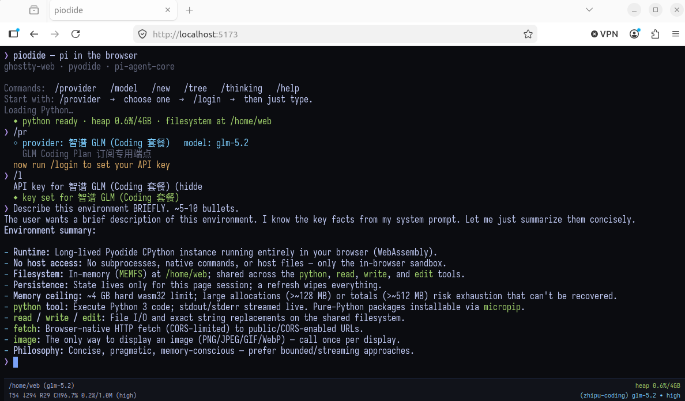
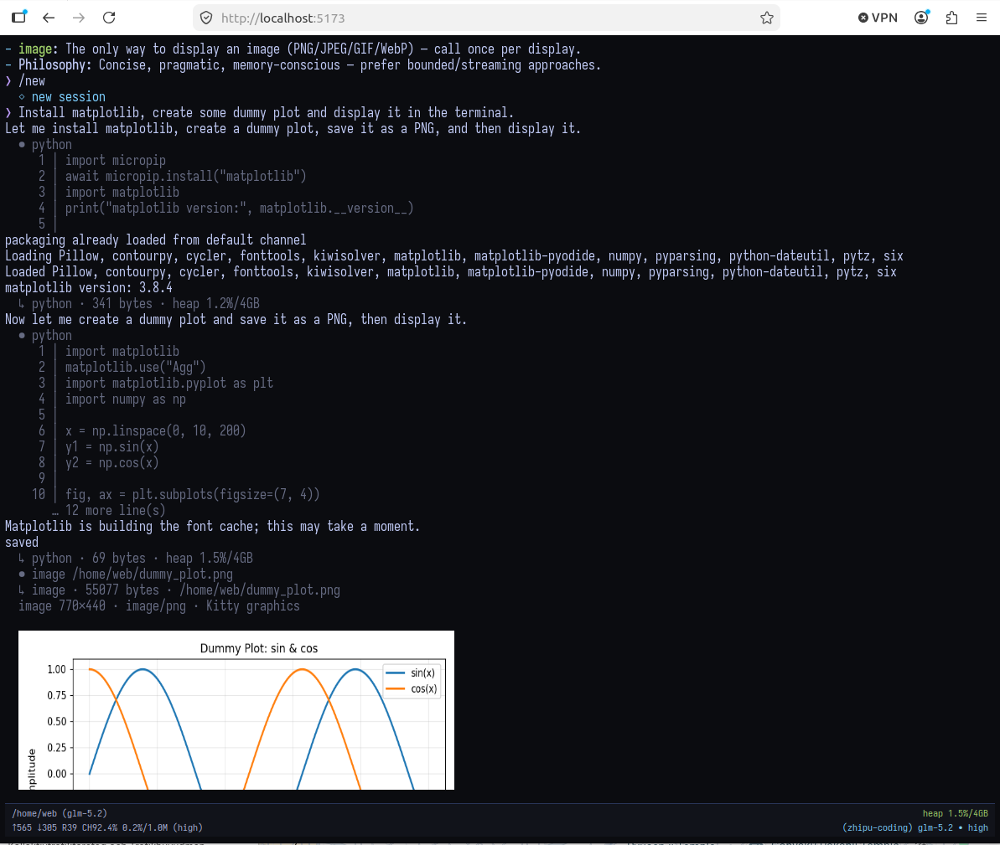
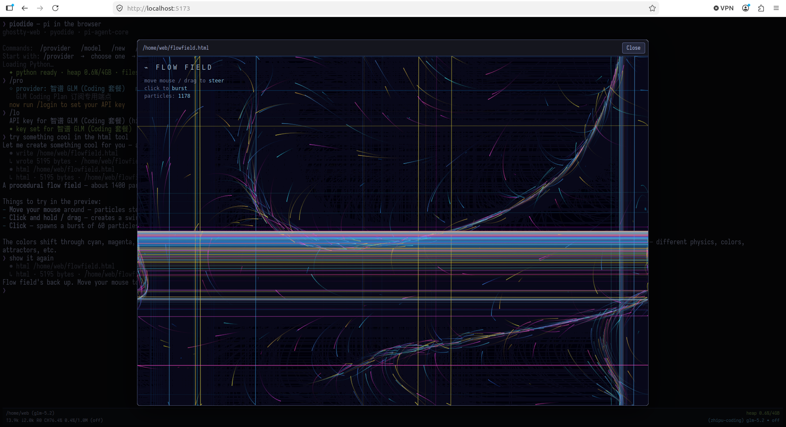
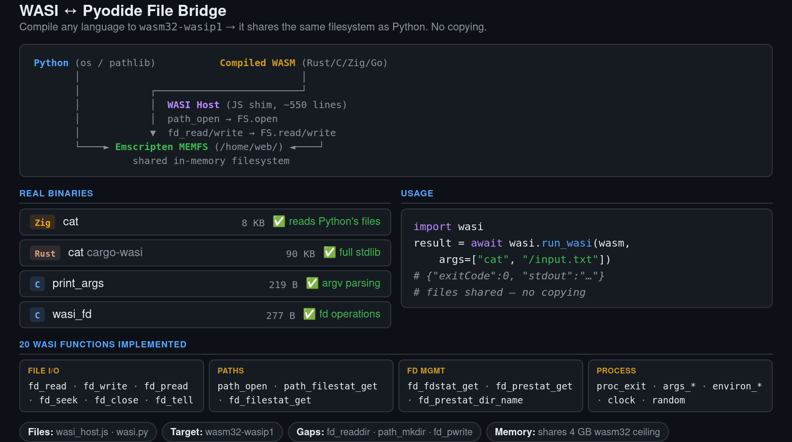

# piodide

*Entirely vibe coded POC*

The idea is simple, run pi agent in the browser and replace bash with pyodide (python in wasm).

Added some extra tools (neovim, github integration), tricky part is integrating stuff with pyodide file system.

Ghostty-web terminal (also wasm).

Surprisingly powerful.







## WASI

A from-scratch WASI runtime (`src/wasi/`) runs wasm32-wasi programs against
the **live** Pyodide filesystem — no copying, no snapshotting. A file written
by a WASI program is immediately visible to Python, Neovim, and the agent
tools, and vice versa.

- `host.ts` implements ~45 `wasi_snapshot_preview1` syscalls (full fd I/O
  including `pread`/`pwrite`/`readdir`, the whole `path_*` family,
  `poll_oneoff`, …) plus the legacy `wasi_unstable` (snapshot0) ABI used by
  older binaries like the runno clang. Filesystem calls go through a small
  pluggable interface.
- Two execution strategies share the host: a **worker** whose syscalls are
  bridged synchronously to the main-thread MEMFS over a SharedArrayBuffer
  (`Atomics.wait`/`waitAsync`) when the page is cross-origin isolated (dev
  server, `vite preview`) — killable and with interactive stdin — and a
  **main-thread** fallback for GitHub Pages (no headers, no
  SharedArrayBuffer), where programs still share the MEMFS directly.
- The in-browser C toolchain (clang + wasm-ld, fetched lazily from
  runno.dev) runs on the same host with a `/sys` sysroot overlay, so
  `compile_c` output lands directly in `/home/web`.

Ways to run programs:

- `/run prog.wasm [args…]` in the terminal (interactive line-buffered stdin,
  Ctrl+C kills, Ctrl+D sends EOF).
- From Python: `import wasi; result = await wasi.run_wasi("/home/web/prog.wasm", args=[...])`.
- From the agent: the `run_wasi` tool.

`node --experimental-strip-types --test "test/*.test.ts"` covers the host,
the Emscripten bridge, the SAB RPC stack, and a full
clang-compile → wasm-ld-link → run cycle (see `test/README.md`).



## slop — the piodide shell

Press **Ctrl+Shift+S** to toggle between the agent and `slop`, a minimal
bash-ish shell written in C (`shell/src/slop.c`) running as a WASI program
on the same live filesystem. It keeps its own cwd, and `$PATH` is exactly
`/bin`:

- `/bin/ls`, `/bin/cat`, `/bin/grep` (simple substring grep), `/bin/echo`,
  `/bin/env`, `/bin/fd-find` — tiny C utilities (sources in `shell/src/`,
  also fetched to `/home/web/slop/`). Command lookup matches the **exact
  name**, first hit on `$PATH` — no implicit extensions.
- `cd`, `pwd`, `exit`, `help` are shell builtins (`cd` must be: a child
  can't change its parent's cwd).
- `cat f.txt | grep x | grep -v y` pipes, `cmd > f` / `cmd >> f` redirects
  (redirect beats pipe, like bash), `&&` / `||` short-circuit lists, `;`
  sequences, and `$VAR` / `${VAR}` / `$?` / `\$` expansion (single quotes
  inhibit). Pipes are captured child-to-child
  (bounded at 1 MiB); redirects stream straight into the MEMFS file.
- Programs spawn through a `piodide.spawn` host import: the shell asks the
  runtime to run a sibling process with explicit stdin/stdout routing
  (pipe in/out, file, or terminal), the terminal foreground switches to
  it, and the exit code comes back. Children can spawn children.
- Spawned programs receive the shell cwd as their `.` WASI preopen, so
  relative paths work without `chdir` or `getcwd` (neither function is
  available in the legacy libc). The shell also keeps `$PWD` synchronized.
- `cc -c hello.c -o hello.o` / `ld hello.o -o /bin/hello` are host-routed
  pseudo-commands, with `compile` and `link` retained as aliases. Supported
  compiler controls are C11/C17, `-O0` through `-O3`/`-Os`, `-g`,
  `-Wall`/`-Wextra`/`-Werror`, `-D`, and `-I`; the linker accepts `-s` and
  `--export`. Run `cc --help` or `ld --help` for the bounded syntax.
- The first compile or link lazily loads about 52 MB of legacy Clang 8,
  wasm-ld, and WASI sysroot assets. There is no `make`, `ar`, package
  manager, native executable output, or incremental build graph: compile
  each translation unit separately, link the objects, then run the WASI
  result from Slop, Python, or the agent.
- Ctrl+C kills the foreground program (or cancels the line), Ctrl+D sends
  EOF (or exits the shell). Typed-ahead input behaves like a tty: one shared
  buffer, consumed by whatever reads next.

Interactive mode needs cross-origin isolation. Dev/`vite preview` send the
headers; on GitHub Pages a tiny service worker (`public/coi-serviceworker.js`)
adds them so the deployed shell works too. Without isolation everything
falls back to main-thread (non-interactive) execution.

## Browser-local models

The first two `/provider` choices run inference entirely inside the browser.
Prompts and tool results do not go to an inference API. The first prompt asks
before downloading a model, and subsequent sessions reuse the browser cache.

- `/provider webllm` is the GPU-only WebLLM/MLC path. It runs inference in a
  Web Worker and is the better fit for Chrome and larger GPU-resident models.
  Hermes 3 Llama 3.1 8B is the default (4.22 GiB download, roughly 6 GiB
  VRAM with this app's 8K context) because it supports the agent's tools.
  Tool requests use XGrammar structural tags: normal replies remain free-form,
  while a `<tool_calls>` envelope is constrained to valid JSON, known tool
  names, and each tool's argument schema.
  Hermes 3 Llama 3.2 3B and
  Qwen3.5 4B/9B are also available, but are labelled `text only` because
  WebLLM does not currently list those builds as function-calling models.
  The catalogue uses q4f32 MLC builds so it can run even when the adapter does
  not expose the optional `shader-f16` feature required by q4f16.
- `/provider wllama` is the GGUF path formerly named `browser`.
  `/provider browser` and `/provider wasm` remain compatibility aliases.
  Qwen3 8B Q4_K_M is the default 4.68 GiB general/tool-use model; Qwen3.5
  0.8B and 2B remain available as the smaller 508 MiB and 1.19 GiB options.
  All three let you choose a 4K, 8K, 16K, or 32K cache allocation and use
  native GGUF chat templates for tool calling. 16K is the balanced Qwen3 8B
  default for a 12 GiB GPU. On the tested RTX 5070, total VRAM use was about
  5.5/5.8/6.4/7.7 GiB for 4K/8K/16K/32K respectively, with effectively the
  same short-prompt decoding speed. 32K works, but 16K leaves more headroom
  for the browser and other GPU applications. Qwen3 8B also supports a binary
  `/thinking off|high` toggle;
  Shift+Tab cycles between those two settings.
- Wllama's current native WebGPU backend requires an adapter with
  `shader-f16`, not merely `navigator.gpu`. Smaller models fall back to
  multithreaded WebAssembly when it is missing; the 4.68 GiB Qwen3 8B model
  reports a launch error because it cannot fit in Wllama's wasm32 heap.
  WebLLM requires WebGPU and reports an error instead of silently running
  inference on the CPU.
- Chrome on Linux/NVIDIA needs Dawn's NVIDIA f16 toggle. Fully quit Chrome
  (opening another window of an existing process does not apply new flags),
  then run `npm run chrome:webgpu`. The launcher uses Chrome's Vulkan/ANGLE
  WebGPU path and enables `vulkan_enable_f16_on_nvidia`.
- Firefox 152 on Linux needs three `about:config` preferences enabled for the
  Wllama GPU path: `dom.webgpu.enabled`, `dom.webgpu.workers.enabled`, and
  `javascript.options.wasm_js_promise_integration`. Restart Firefox after
  changing them. Without page WebGPU, worker WebGPU, and JSPI, Wllama falls
  back to CPU WASM or its much slower compatibility backend.
- `/model status`, `/model unload`, `/model remove [id]`, and `/model
  clear-cache` inspect or control the active local provider and its persistent
  browser cache.
- Local inference needs substantial browser storage and memory and is slower
  than hosted providers on many machines. The local provider therefore uses a
  shorter environment prompt and a bounded output cap. Downloaded models
  remain cached when the runtime is unloaded.

## Quickstart

```bash
npm install
npm run dev
```

Open http://localhost:5173, then use `/provider`, `/login` when required, and
`/model`. Typing `/` shows the available commands. Press `Ctrl+Shift+E` to
toggle Neovim (`:Ex` browses the same `/home/web` files used by the agent and
Python) and `Ctrl+Shift+S` to toggle the slop shell. In the terminal views,
`Ctrl+Shift+C` copies the active selection and `Ctrl+Shift+V` pastes plain
clipboard text.

## Agent tools

- `python` — runs Python in the shared Pyodide runtime with live output;
  pure-Python packages can be installed with `micropip`.
- `compile_c` / `link_wasi` / `run_wasi` — compile C into `.o` files, link
  objects into WASI executables, and run them against the live `/home/web`
  filesystem (see the WASI section above).
- `read` — reads text files from `/home/web` with line numbers and pagination.
- `write` — creates or replaces files in the in-browser filesystem.
- `edit` — applies exact, unique text replacements to existing files.
- `download` — saves a Pyodide file through the browser; `/upload` imports host
  files into `/home/web`.
- `git` — uses Dulwich locally; GitHub clone, pull, and push use its browser API
  (`/github` registers a page-local token).
- `fetch` — uses browser `fetch` (and its CORS rules), optionally saving the
  response to `/home/web`.
- `image` — renders a saved PNG, JPEG, GIF, or WebP directly in the terminal
  through Kitty graphics.
- `html` — opens a self-contained HTML file in a sandboxed, closeable preview.

All tools share the same temporary in-memory filesystem. API keys and GitHub
tokens stay in page memory, and refreshing the page clears the runtime and files.
