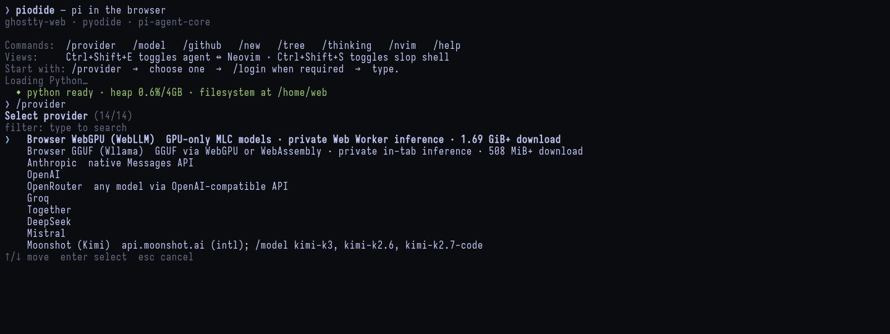
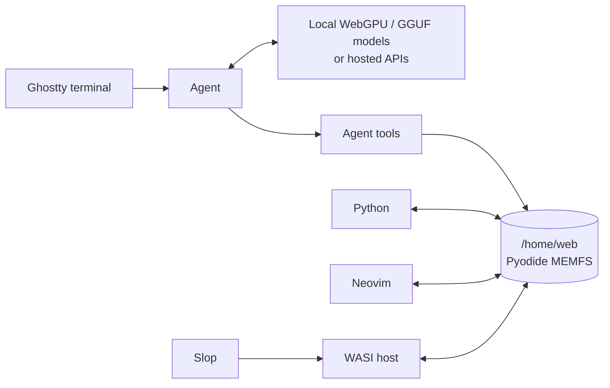

# piodide

A coding agent, Python runtime, shell, editor, and local LLM host that run in
one browser tab.

**[Open Piodide](https://daugasauron.github.io/piodide/)**



## Inside the tab



Everything reads and writes the same in-memory workspace. Refreshing the page
clears it.

## Run locally

```bash
npm install
npm run dev
```

Open <http://localhost:5173/piodide/>, run `/provider`, then `/model`.

| Action | Shortcut |
| --- | --- |
| Agent ↔ Neovim | `Ctrl+Shift+E` |
| Agent ↔ Slop shell | `Ctrl+Shift+S` |
| Cycle thinking level | `Shift+Tab` |

## Documentation

| Guide | Contents |
| --- | --- |
| [Workspace](docs/workspace.md) | Pyodide filesystem, Neovim, files, GitHub |
| [Local models](docs/local-models.md) | WebLLM, Wllama, GPU setup, model cache |
| [Agent tools](docs/agent-tools.md) | Python, files, Git, previews, C toolchain |
| [Slop shell](docs/slop.md) | Commands, pipes, redirects, compilation |
| [WASI runtime](docs/wasi.md) | Host design, execution modes, Python bridge |
| [Development](docs/development.md) | Scripts, tests, Pages, screenshots |
| [Codex proxy](docs/codex-proxy.md) | Optional loopback subscription bridge |

Piodide is an experimental proof of concept.
