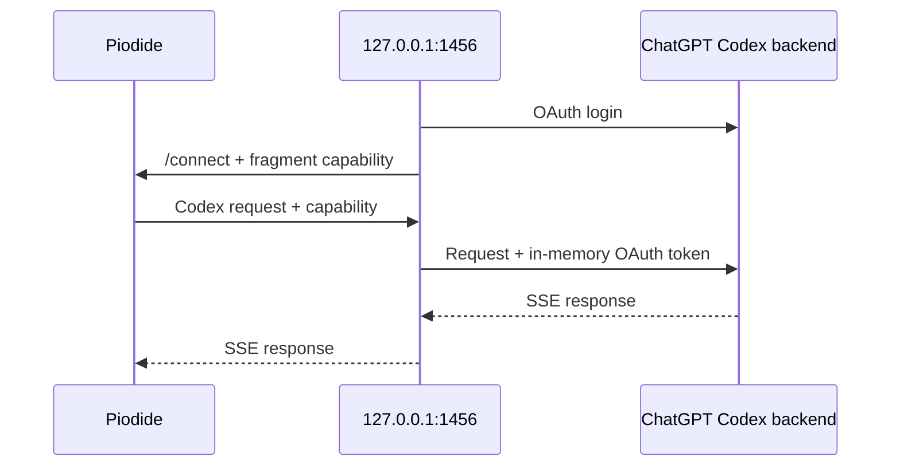

# Local Codex proxy

[← README](../README.md)

This optional loopback bridge connects Piodide to a ChatGPT Codex
subscription. It is a personal, undocumented integration and may change.



The OpenAI access and refresh tokens never enter the browser.

## Run

Start Piodide:

```bash
npm run dev
```

In another terminal:

```bash
npm run codex-proxy
```

The proxy opens authorization, then opens Piodide already connected. Select
`/provider codex-local`. `/logout` stops the proxy.

## Options

| Variable | Purpose |
| --- | --- |
| `PIODIDE_URL` | Page to open after login |
| `PIODIDE_ORIGINS` | Comma-separated exact origin allowlist |
| `CODEX_PROXY_DEVICE_AUTH=1` | Use device-code login |
| `CODEX_PROXY_NO_OPEN=1` | Print links instead of opening a browser |
| `CODEX_PROXY_BROWSER=firefox` | Choose a browser executable |

GitHub Pages example:

```bash
PIODIDE_URL=https://daugasauron.github.io/piodide/ npm run codex-proxy
```

## Security boundary

- Binds only to `127.0.0.1:1456`.
- Accepts exact allowed browser origins.
- Relays only the fixed Codex responses endpoint.
- Keeps OAuth credentials in process memory.
- Passes the browser capability in a URL fragment and removes it immediately.
- Persists no credentials or configuration.
