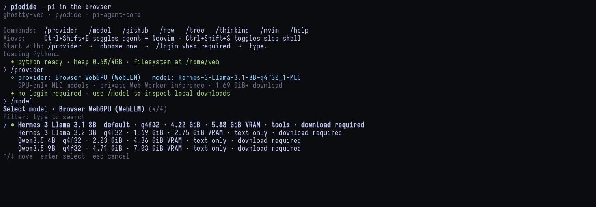

# Local models

[← README](../README.md)

`/provider webllm` and `/provider wllama` keep inference inside the browser.
The first load asks before downloading; later sessions use the browser cache.



## Choose a runtime

| Provider | Backend | Best fit | Tool-capable default |
| --- | --- | --- | --- |
| `webllm` | WebGPU + MLC worker | Chrome; larger GPU-resident models | Qwen3.5 4B |
| `wllama` | GGUF WebGPU or WASM | GGUF models; selectable KV cache | Qwen3 8B Q4_K_M |

The q4f16 WebLLM catalogue and Wllama's WebGPU path require `shader-f16`.
Wllama can run smaller models on multithreaded WASM when it is absent.

## WebLLM catalogue

| Model | Download | VRAM | Context | Tools |
| --- | ---: | ---: | ---: | --- |
| Qwen3.5 4B q4f16 | 2.23 GiB | 3.73 GiB | 8K | Yes |
| Qwen3.5 9B q4f16 | 4.71 GiB | 6.12 GiB | 8K | Yes |
| Qwen3.5 2B q4f16 | 1.01 GiB | 2.22 GiB | 8K | Yes |
| Hermes 3 Llama 3.1 8B q4f16 | 4.22 GiB | 5.04 GiB | 8K | Yes |
| Hermes 3 Llama 3.2 3B q4f16 | 1.69 GiB | 2.55 GiB | 8K | No |

Qwen3.5 uses Piodide's schema-constrained tool bridge. The generated call is
limited to the tools and argument schemas available to the agent.

Piodide serves each small WebLLM chat config from its own origin to avoid
Hugging Face metadata-redirect CORS failures. Model weights still come from
the upstream MLC repositories and remain in WebLLM's browser cache.

WebLLM offers 8K, 16K, and 32K contexts during model selection. The 8K
default is the smallest size that fits Piodide's agent prompt and tool schemas.

## Wllama catalogue

| Model | Download | Default context | Tools | Thinking |
| --- | ---: | ---: | --- | --- |
| Qwen3 8B Q4_K_M | 4.68 GiB | 16K | Yes | Off / high |
| Qwen3.5 9B Q4_K_M | 5.29 GiB | 8K | Yes | No |
| Qwen3.5 4B Q4_K_M | 2.55 GiB | 8K | Yes | No |
| Qwen3.5 2B Q4_K_M | 1.19 GiB | 8K | Yes | No |
| Qwen3.5 0.8B Q4_K_M | 508 MiB | 8K | Yes | No |

Every Wllama model offers 4K, 8K, 16K, and 32K cache sizes. On the tested
12 GiB RTX 5070, Qwen3 8B used about 5.5/5.8/6.4/7.7 GiB at those sizes.
Qwen3.5 9B is the strongest practical Wllama choice for that GPU; use 4B
when lower latency matters more.

## Linux GPU setup

Chrome on NVIDIA:

```bash
npm run chrome:webgpu
```

Fully quit Chrome first; flags do not change an existing process.

Firefox needs these `about:config` values enabled, followed by a restart:

```text
dom.webgpu.enabled
dom.webgpu.workers.enabled
javascript.options.wasm_js_promise_integration
```

## Commands

```text
/model
/thinking off|high
/model status
/model import [id]
/model unload
/model remove [id]
/model clear-cache
```

`/model import [id]` imports without downloading the model weights again:

- Wllama selects one GGUF whose size matches the catalogue entry.
- WebLLM selects an MLC model directory. It validates the chat config,
  tokenizer, tensor manifest, and every parameter shard before caching them.

Download the default WebLLM directory on the host with:

```bash
hf download mlc-ai/Qwen3.5-4B-q4f16_1-MLC \
  --local-dir Qwen3.5-4B-q4f16_1-MLC
```

The matching model-library WASM is optional in that directory. Without it,
WebLLM downloads and caches the roughly 6 MiB library on first load.
