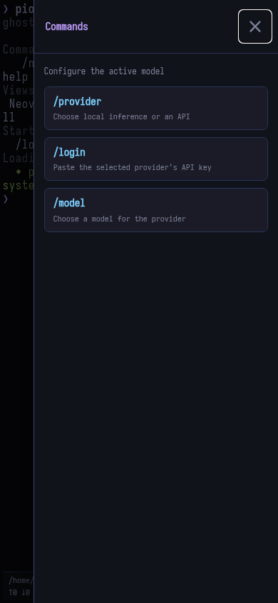
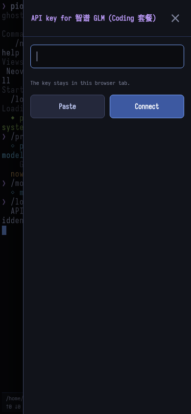

# Mobile controls

[← README](../README.md)

Tap the floating `/` button or swipe left from the right edge.

| Commands | Login |
| --- | --- |
|  |  |

1. Choose `/provider`.
2. Choose `/model`.
3. Choose `/login`, paste the API key, and tap **Connect**.
4. Choose `/thinking` to set the model's supported effort level.
5. Try `/demo` to generate a touch-first C/WebAssembly game.

The drawer is limited to these five commands. Terminal swipes scroll history
with frame-batched, fractional movement;
the keyboard's Done button submits the current line. The status footer stacks its
model and usage rows on narrow screens. API keys stay in page memory
and are cleared on refresh. General GLM keys are checked without running a
completion. Coding Plan keys are validated by the first real request because
the Coding endpoint has no compatible non-billable key check. A GLM value
without the dot in `id.secret` is rejected as an incomplete copy.
