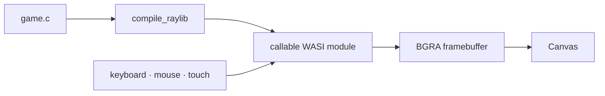
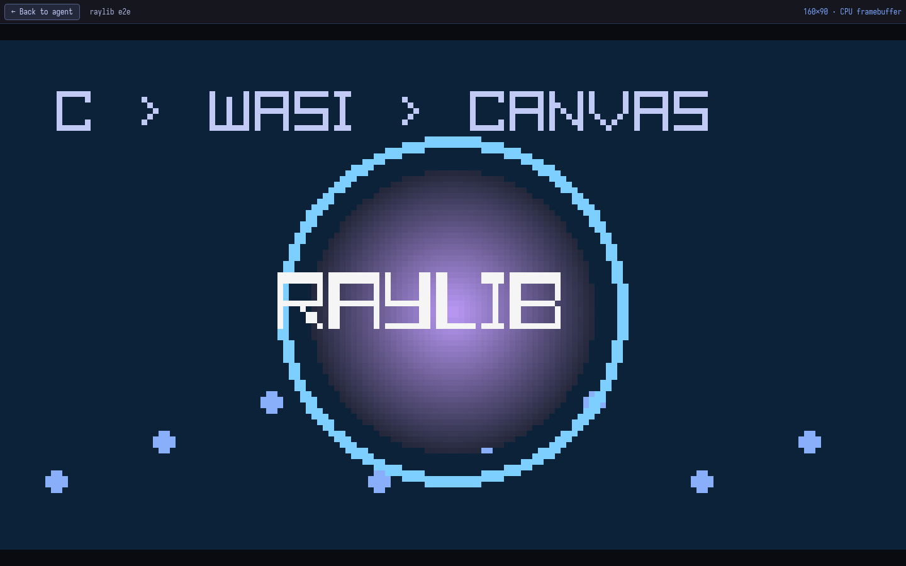

# Raylib framebuffer

[← README](../README.md)

Raylib 6 runs as a callable WASI module. Its software renderer writes BGRA
pixels into WebAssembly memory; the browser converts them to a full-screen
canvas.





## Game shape

```c
#include "raylib.h"

void game_init(void) {
    // Initialize game state. The browser already called InitWindow().
}

void game_frame(float dt) {
    // Update using dt and standard raylib input functions.
    BeginDrawing();
    ClearBackground((Color){ 18, 22, 32, 255 });
    DrawText("Hello from C", 24, 24, 28, RAYWHITE);
    EndDrawing();
}
```

The agent compiles with `compile_raylib`, then validates and displays with
`raylib`. `/demo` uses this path for an interactive, particle-heavy Wasm
performance showcase; the preview supplies the WASI imports automatically.

## Limits

- CPU software rendering; prefer `640×360` on desktop and `320×568` on phones.
- 2D shapes, text, textures, keyboard, mouse, and touch are enabled.
- Audio and `rmodels` are omitted.
- The browser owns `InitWindow`, the animation loop, and `CloseWindow`;
  `SetTargetFPS()` is unnecessary.
- The framebuffer is capped at 1280×720.

Raylib 6 source and license are pinned by SHA-256. Generated objects are under
`public/raylib/`; rebuild them with `npm run build:raylib`.
