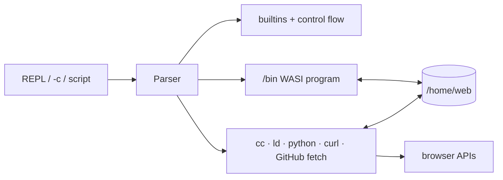

# Slop shell

[← README](../README.md)

Slop is a small C build shell running as a WASI program. Toggle the interactive
session with `Ctrl+Shift+S`. The same module is installed as `/bin/sh` for
scripts and Make recipes.




## Shell language

| Feature | Example |
| --- | --- |
| Pipeline | `cat file.txt \| grep needle` |
| Redirect | `sort < input > output` |
| Append | `echo again >> file.txt` |
| Conditions | `first && second \|\| fallback` |
| Expansion | `$VAR`, `${VAR:-default}`, `$?`, `$1`, `$*` |
| Command substitution | `name=$(basename "$path")` |
| Arithmetic | `next=$((count + 1))` |
| Globbing | `echo src/*.c` |
| Stderr | `command 2> errors.txt`, `command 2>&1` |
| Blocks | line-oriented `if`, `for`, `while`, and `case` |
| Functions | `build() { cc -c main.c -o main.o; }` |
| Scripts | `sh script.sh`, `slop script.sh`, or an executable text path |

Slop supports `-c`, `-s`, script arguments, general backslash escaping,
assignments, exported variables, `set -e`, and `set -x`. Common builtins include
`cd`, `echo`, `printf`, `test`, `export`, `unset`, `read`, `shift`, `type`,
`command -v`, `eval`, `source`, `break`, and `continue`.

## Installed commands

The shell installs the original `ls`, `cat`, `grep`, `echo`, `env`, and
`fd-find`, plus:

```text
make sh python python3 git curl sed ar
rm cp mv mkdir rmdir touch ln head tail wc sort cut tr tee
basename dirname seq cmp install readlink find mktemp chmod uniq xargs
```

These are bounded browser-oriented implementations. `sed` and `ar` provide
practical subsets rather than every GNU extension. `make` supports timestamp
dependencies, variables, explicit and `%` pattern rules, `.PHONY`, includes,
conditionals, common Make functions, automatic variables, and the usual
serial-build options. `-j` is accepted but execution remains serial.

## Compile with Make

```make
CFLAGS := -O2 -Wall -Wextra
all: hello.wasm
```

With `hello.c` present, the built-in rules compile and link it:

```sh
make
./hello.wasm
```

You can still invoke the bounded toolchain directly:

```sh
cc -c -std=c17 -O2 hello.c -o hello.o
ld hello.o -o hello.wasm
```

The first compilation downloads about 52 MiB of pinned Clang 8, wasm-ld, and
sysroot assets.

## Python

`python` and `/bin/python` run code in the same long-lived Pyodide CPython
runtime used by the agent tools:

```sh
python -c 'print(6 * 7)'
python script.py arg
cat script.py | python -
```

Arguments, exported variables, the Slop working directory, piped stdin, exit
status, pipes, and redirects are preserved. Interactive Python mode is not
available; use `-c`, `-m`, a script, or `-`.

## Git

`/bin/git` is a compiled Slop command backed by libgit2 WebAssembly:

```sh
git init -b main
git add .
git commit -m "first commit"
git status --short
git log --oneline
```

Repositories use the standard `.git` object, ref, config, and binary index
formats. Loose and packed repositories work with desktop Git and libgit2.

Common commands include `init`, `status`, `add`, `commit`, `log`, `diff`,
`branch`, `switch`, `checkout`, `merge`, `restore`, `reset`, `remote`,
`fetch`, `pull`, `push`, `ls-remote`, `stash`, `tag`, `cherry-pick`, `clean`,
`fsck`, and `gc`.

Cloning another repository already under `/home/web` preserves its complete
history and supports local fetch/pull/push. Uploaded standard repositories can
also be used directly.

Network transport has two modes:

| Mode | Result |
| --- | --- |
| CORS-enabled Git server | Full smart HTTP: history, branches, tags |
| `--cors-proxy URL` | Full smart HTTP through a proxy you trust |
| Direct GitHub | Bounded one-branch snapshot fallback |

Set a proxy once with `git config --global http.corsProxy URL`. Tokens are not
sent through a proxy. Run `/github` for private direct-GitHub snapshots and
pushes.

The snapshot fallback caps repositories at 32 MiB / 3,000 files and creates a
local import commit. It is not a historical clone.

Local commands use [wasm-git](https://github.com/petersalomonsen/wasm-git)
(libgit2) and [isomorphic-git](https://isomorphic-git.org/). The wasm-git
GPL-2.0 linking-exception license ships as `wasm-git-COPYING.txt`.

## Curl

`curl` is a bounded, browser-fetch HTTP client:

```sh
curl -fsS https://example.com/data.json | grep name
curl --json '{"ok":true}' https://example.com/api
curl -L -o result.bin https://example.com/result.bin
```

See [Browser curl](curl.md) for supported flags, CORS and redirect behavior,
exit codes, and limits.

## Controls and limits

- `Ctrl+C`: stop the foreground program or clear the line.
- `Ctrl+D`: send EOF or exit an empty shell.
- Pipelines execute sequentially and buffer at most 1 MiB per stage. Overflow
  fails before the consumer runs; write large output directly to a file.
- `/bin/git` is WASI-native; libgit2 and GitHub transfer are browser-hosted Wasm/JS.
- Background jobs, process groups, streaming pipelines, and heredocs are not
  implemented.
- Compound syntax is line-oriented. Functions cannot be piped, redirected, or
  used in command substitution.
- `xargs` splits bounded input on whitespace and supports `-n`; it is not the
  complete GNU utility. WASI `chmod` validates paths and modes but permissions
  remain host-managed.
- WASI programs still have no sockets, `fork`, or general host OS access.
