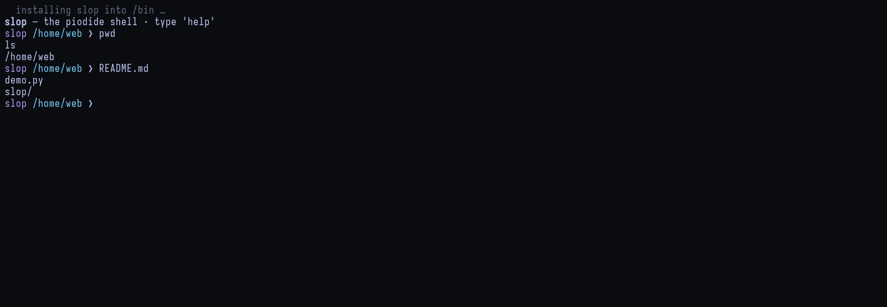
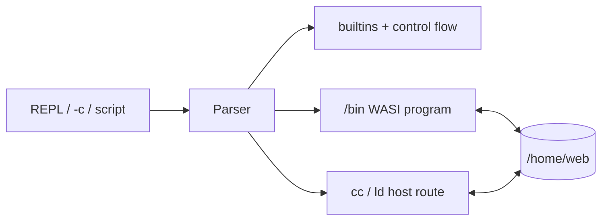

# Slop shell

[← README](../README.md)

Slop is a small C build shell running as a WASI program. Toggle the interactive
session with `Ctrl+Shift+S`. The same module is installed as `/bin/sh` for
scripts and Make recipes.





## Shell language

| Feature | Example |
| --- | --- |
| Pipeline | `cat file.txt \| grep needle` |
| Redirect | `sort < input > output` |
| Append | `echo again >> file.txt` |
| Conditions | `first && second \|\| fallback` |
| Expansion | `$VAR`, `${VAR:-default}`, `$?`, `$1`, `$*` |
| Command substitution | `name=$(basename "$path")` |
| Globbing | `echo src/*.c` |
| Blocks | line-oriented `if`/`elif`/`else`, `for`, and `while` |
| Scripts | `sh script.sh`, `slop script.sh`, or an executable text path |

Slop supports `-c`, `-s`, script arguments, general backslash escaping,
assignments, exported variables, `set -e`, and `set -x`. Common builtins include
`cd`, `echo`, `printf`, `test`, `export`, `unset`, `read`, `shift`, `type`,
`command -v`, `eval`, `source`, `break`, and `continue`.

## Installed commands

The shell installs the original `ls`, `cat`, `grep`, `echo`, `env`, and
`fd-find`, plus:

```text
make sh sed ar
rm cp mv mkdir rmdir touch ln head tail wc sort cut tr tee
basename dirname seq cmp install readlink find mktemp
```

These are bounded browser-oriented implementations. `sed` and `ar` provide
practical subsets rather than every GNU extension. `make` supports timestamp
dependencies, variables, explicit and `%` pattern rules, `.PHONY`, includes,
conditionals, common Make functions, automatic variables, and the usual
serial-build options. `-j` is accepted but execution remains serial.

## Compile with Make

```make
CFLAGS := -O2 -Wall -Wextra
all: hello.wasm
```

With `hello.c` present, the built-in rules compile and link it:

```sh
make
./hello.wasm
```

You can still invoke the bounded toolchain directly:

```sh
cc -c -std=c17 -O2 hello.c -o hello.o
ld hello.o -o hello.wasm
```

The first compilation downloads about 52 MiB of pinned Clang 8, wasm-ld, and
sysroot assets.

## Controls and limits

- `Ctrl+C`: stop the foreground program or clear the line.
- `Ctrl+D`: send EOF or exit an empty shell.
- Pipelines execute sequentially and buffer at most 1 MiB per stage.
- Background jobs, process groups, streaming pipelines, and child stderr
  redirection are not available through the current spawn ABI.
- Compound syntax is intentionally line-oriented; shell functions, `case`, and
  heredocs are not implemented.
- WASI programs still have no sockets, `fork`, or general host OS access.
