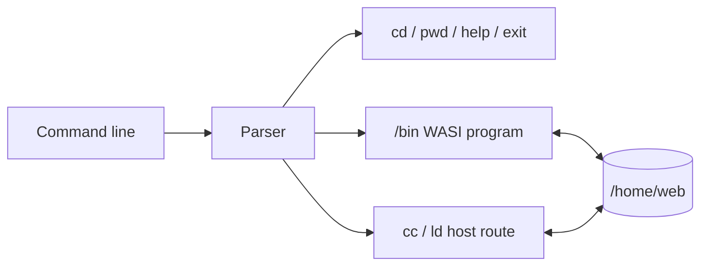

# Slop shell

[← README](../README.md)

Slop is a small C shell running as a WASI program. Toggle it with
`Ctrl+Shift+S`.




## Syntax

| Feature | Example |
| --- | --- |
| Pipeline | `cat file.txt \| grep needle` |
| Redirect | `echo hello > file.txt` |
| Append | `echo again >> file.txt` |
| Conditions | `first && second \|\| fallback` |
| Sequence | `one; two` |
| Expansion | `$VAR`, `${VAR}`, `$?` |

`$PATH` is `/bin`. Included commands are `ls`, `cat`, `grep`, `echo`, `env`,
and `fd-find`.

## Compile in the shell

```sh
cc -c -std=c17 -O2 hello.c -o hello.o
ld hello.o -o /bin/hello
hello
```

`cc` compiles one translation unit. `ld` links objects into one WASI module.
The first build downloads about 52 MiB of pinned Clang 8, wasm-ld, and sysroot
assets.

## Controls and limits

- `Ctrl+C`: stop the foreground program or clear the line.
- `Ctrl+D`: send EOF or exit an empty shell.
- Pipes are bounded to 1 MiB.
- No `make`, `ar`, package manager, or native executable output.
- Interactive children require cross-origin isolation.
