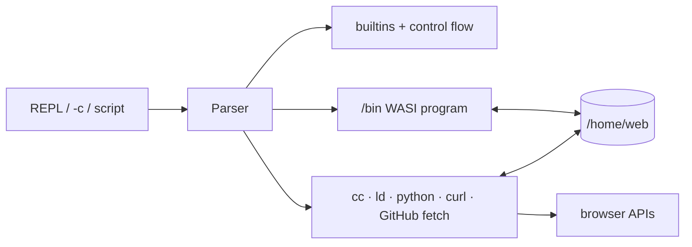

# Slop shell

[← README](../README.md)

Slop is a small C build shell running as a WASI program. Toggle the interactive
session with `Ctrl+Shift+S`. The same module is installed as `/bin/sh` for
scripts and Make recipes.




## Shell language

| Feature | Example |
| --- | --- |
| Pipeline | `cat file.txt \| grep needle` |
| Redirect | `sort < input > output` |
| Append | `echo again >> file.txt` |
| Conditions | `first && second \|\| fallback` |
| Expansion | `$VAR`, `${VAR:-default}`, `$?`, `$1`, `$*`, standalone quoted `"$@"` |
| Command substitution | `name=$(basename "$path")` |
| Arithmetic | `next=$((count + 1))` |
| Globbing | `echo src/*.c` |
| Stderr | `command 2> errors.txt`, `command 2>&1`, `command >&2` |
| Blocks | bounded `if`, `for`, `while`, and `case` compounds |
| Functions | `build() { cc -c main.c -o main.o; }` |
| Scripts | `sh script.sh`, `slop script.sh`, or an executable text path |

Slop supports `-c`, `-s`, script arguments, general backslash escaping,
assignments, exported variables, `set -euo pipefail`, and `set -x`. Common builtins include
`cd`, `echo`, `printf`, `test`, `export`, `unset`, `read`, `shift`, `type`,
`which`, `command -v`, `local`, `eval`, `source`, `return`, `exit`, `break`, and
`continue`. `export` and `unset` validate every operand before changing the
environment. `shift` accepts one decimal count from 0 through 128; `return`
and `exit` accept one decimal status from 0 through 255. Malformed operands
return status 2, while shifting past the positional arguments returns status 1.
An exact standalone quoted `"$@"` expands to zero or one word per current
positional parameter, preserving empty values and whitespace within each
argument. It follows the current script, function, `sh -c`, or sourced-file
scope, and observes `shift`; with no parameters it contributes no word.
Concatenated forms such as `"pre$@post"` fail with status 2 instead of silently
flattening the vector. Unquoted `$@` and `$*` retain the bounded joined-string
behavior; general IFS splitting and shell arrays remain outside the API.
Spawned commands retain empty arguments through the count-aware host ABI. A
parsed command is limited to 127 total words and its serialized child argv is
limited to 1 MiB; the Git frontend applies the same 1 MiB forwarding bound.
`readonly` and `umask` fail explicitly with status 2 because the bounded shell
has neither readonly-variable state nor truthful permission modes.
`set` prints the four bounded option states when called without operands and
validates a complete `-/+eux` or `-/+o pipefail` request before changing any
option. `set -- [ARG...]` atomically replaces the active script, function, or
sourced-file positional vector; bare `set --` clears it, and subsequent `$#`,
`$1`…`$@`, and `shift` observe the replacement. Replacement is limited to 100
arguments, 4,096 bytes per argument, and 65,536 aggregate bytes. A limit
failure preserves the previous vector, and option changes cannot be combined
with positional replacement. `local` likewise validates every name before
creating function-local state. `break` and
`continue` accept no operand or level `1` inside an active loop; other levels
and calls outside a loop fail with status 2.
`source [--] FILE [ARG...]` temporarily supplies its arguments to the sourced
file and restores the caller's positional parameters afterward. `return`
exits the innermost function or sourced file, and source nesting is capped at
eight before execution to stay within the WASM stack bound.
`help [BUILTIN]` prints the accepted contract for a builtin. `command -v`,
`type`, and `which` require at least one name, accept `--`, reserve status 1
for a well-formed missing name, and reject unknown option shapes with status
2 before emitting partial query output. Bounded `command [--] NAME [ARG...]`
invokes a builtin or executable while bypassing shell functions, so
`sh -c 'command "$@"' label ...` can forward an exact positional vector.
`pwd` exposes the logical cwd through
plain, `-L`, or `--logical` forms and accepts `--`; `pwd -P` and `cd -P` fail explicitly because
physical cwd tracking is unavailable. Nested `eval` is capped at eight.
`read -r` is accepted as the conventional backslash-preserving spelling;
Slop always preserves backslashes. A read value is bounded to 4,095 bytes;
longer physical lines return status 2 after being consumed and leave the old
variable unchanged. `printf [--] FORMAT [ARG...]` supports `%%`, `%s`, `%c`,
`%d`, `%i`, `%u`, `%o`, `%x`, and `%X`, validates the complete format and all
supplied 32-bit base-0 numeric operands before output, and reuses the format
for remaining arguments. Unsupported conversions and escapes fail with status
2 instead of being copied or coerced. Missing string and integer operands use
empty and zero; missing `%c` emits NUL, while supplied `%c` uses its first
byte. `echo` treats only one initial exact `-n` specially and otherwise treats
dash-leading words literally. A normally
exhausted `while` loop returns the last body status, or zero when its body never ran.
Common `if`/`for`/`while` compounds may be written on one line with semicolon
separators; quoted, escaped, function-body, and command-substitution semicolons
retain their ordinary command-list meaning. Quoted pipeline, redirection, and
descriptor-looking words remain data.

## Installed commands

The shell installs the original `ls`, `cat`, `grep`/`rg`, `echo`, `env`, and
`fd-find`, plus:

```text
make sh python python3 git curl cc compile ld link sed ar
rm cp mv mkdir rmdir touch ln head tail wc sort cut paste tr tee
basename dirname seq cmp comm join diff install readlink realpath du find mktemp chmod uniq xargs stat xxd base64 strings truncate
printf true false sha256sum date sleep
```

Use `rg PATTERN [PATH]` for recursive ERE search and `rg --files` for file
discovery. With no path, `rg` searches `.` even when stdin is piped; use
`rg PATTERN -` to search stdin. Run `help BUILTIN` for shell builtins and
`COMMAND --help` for installed commands. Use Python for JSON, tabular transformations, and archives; `awk`,
`jq`, and `tar` are not installed.

Both search commands support per-file output bounds with `-m COUNT` and
listing nonmatching files (`grep -L` or `rg --files-without-match`). In `rg`,
`-L` retains ripgrep's symlink-following meaning and fails explicitly because
cycle-safe symlink traversal is not part of the current subset.
Common self-documenting aliases are accepted alongside short search flags,
including `--line-number`, `--ignore-case`, `--invert-match`, `--count`,
`--files-with-matches`, `--quiet`, `--fixed-strings`, `--extended-regexp`,
`--recursive`, `--with-filename`, and `--regexp[=PATTERN]` where applicable.
Repeated `-e PATTERN`, `--regexp PATTERN`, and `--regexp=PATTERN` forms build a
union of up to 64 independently validated patterns (65,536 encoded bytes total)
for both `grep` and `rg`. A record matching more than one pattern is still
selected once, and `-v` inverts the complete union. Line search preflights up
to 100 explicit inputs and buffers output, so an invalid regex, later missing
file, read failure, or bound cannot leave plausible partial matches. Its limits
are 1 MiB per record, 16 MiB input, 100,000 records, and 1,000,000 output bytes.
NUL mode retains its documented 16 MiB output bound.
Pathname-only ripgrep output can instead use `-0` or `--null` with `--files`,
`-l`/`--files-with-matches`, or `--files-without-match`. Each selected path is
terminated by NUL, so embedded newlines and leading dashes remain data and the
result composes directly with `sort -z` or `xargs -0`. This flag is distinct
from `--null-data`, which changes input record framing. Null-path output is
staged invocation-wide and bounded to 100 explicit paths, 128 traversal
levels, 100,000 visited/emitted paths, 4,096 bytes per path, and 1 MiB including
terminators. Status 0 means a completed file listing or at least one selected
search path, 1 means a completed pathname search selected none, and 2 means an
invalid combination, inaccessible input, search/traversal failure, or bound;
status 2 emits no pathname bytes.

These are bounded browser-oriented implementations. `sed` and `ar` provide
practical subsets rather than every GNU extension. `make` supports timestamp
dependencies, variables, explicit and `%` pattern rules, `.PHONY`, includes,
conditionals, common Make functions, automatic variables, and the usual
serial-build options. `-j` is accepted but execution remains serial. Freshness
uses the filesystem's full subsecond timestamp fields and conservatively rebuilds
when a normal prerequisite timestamp equals the target; order-only
prerequisites do not participate. `make -q` and automatic `$?` use the same
comparison, preventing immediate same-tick edits from being reported fresh.

Common compatibility limits are explicit:

`sha256sum -c|--check [--] [MANIFEST]` verifies the canonical records emitted
by ordinary hash mode. An ordinary record is 64 case-insensitive hexadecimal
bytes, `  ` or ` *`, and a nonempty literal path. A path containing LF or
backslash instead uses a leading backslash record marker and encodes those
bytes as `\n` and `\\`; marked records decode only those two escapes, while
unmarked backslashes remain literal for compatibility. Carriage return and
other non-NUL path bytes remain literal. The stdin pseudo-path `-` is rejected.
Relative targets use the current directory, not the manifest directory. The
complete nonempty manifest is prevalidated before target I/O and capped at 1
MiB, 4,096 records, and 4,096 encoded bytes per record. Hash mode refuses an
individual record above that encoded bound instead of emitting an uncheckable
line. Ordered `PATH: OK`, `FAILED`, or `FAILED open or read` lines use the same
marked escaping. Status 0 means all matches, 1 a mismatch/read/record-output
failure, and 2 invalid invocation, manifest, bounds, or command output.

| Command/feature | Supported subset |
| --- | --- |
| `ls` | One-entry-per-line sorted listings, `-a`, bounded size/name `-l`, human sizes `-h`, mtime sorting `-t`, reverse `-r`, and directory operands `-d`; 64 operands and 4,096 entries per directory |
| `head` | Line/byte prefixes, plus first-record selection over opaque NUL streams with `-z`/`--zero-terminated`; zero mode caps counts at 100,000, records at 1 MiB, each input at 16 MiB, and an invocation at 64 MiB |
| `tail` | One file or stdin; line suffixes with `-n N`, one-based line starts with `-n +N`, or a raw byte suffix with unsigned `-c N`/`-cN`; byte counts are capped at 16 MiB and input is fully read before byte output |
| `cmp` | Strict byte predicate `cmp [-s] [--] FILE1 FILE2` with at most one stdin; status 0 is equal, 1 is different, and 2 is invalid/I/O failure; `-s` suppresses both output streams |
| `wc` | `-l`/`-w`/`-c`, long `--lines`/`--words`/`--bytes` aliases, multiple files, stdin, and a multi-file total |
| `sha256sum` | Streamed SHA-256 for files/stdin, plus one canonical `-c`/`--check` manifest; LF/backslash filenames use marked escaped records that round-trip through check mode; 1 MiB, 4,096-record, and 4,096-encoded-byte-record limits |
| `date` | UTC only, with RFC 3339 seconds by default, one `+FORMAT` operand, and `%s` Unix time; clock setting is unavailable |
| `sleep` | One finite duration with an optional `s`, `m`, or `h` suffix, capped at 60 seconds |
| `test` / `[` | String, strict decimal integer, file type/existence/size, symlink, and mtime predicates; `-nt`/`-ot` follow links and handle a missing opposite operand; false is status 1, malformed expressions are status 2; `-r`/`-w`/`-x` fail explicitly because modes are unavailable |
| shell state/control | `set`, `export`/`unset`, and `local` validate complete requests before mutation; `set -- [ARG...]` replaces the active positional vector within 100 arguments / 4,096 bytes each / 65,536 bytes total; `shift` accepts decimal 0..128; `return`/`exit` accept decimal 0..255; `source` scopes arguments and return across at most eight nested files; `break`/`continue` support the active current loop; multi-level loop control, `readonly`, and `umask` are explicitly unavailable |
| builtin discovery/cwd | `help [BUILTIN]`; `command -v`, `type`, and `which` accept `--` and one or more names; `command [--] NAME [ARG...]` dispatches without functions; logical `pwd`/`cd -L`; physical cwd mode is unavailable; at most eight nested `eval` calls |
| builtin I/O | atomic bounded `printf [--] FORMAT [ARG...]` with listed conversions and strict 32-bit base-0 integers; one-name raw `read` with a 4,095-byte line/value bound; `echo` recognizes only one initial exact `-n` |
| `env` | Bare environment printing, or `env [-i] [-u NAME]... [--] COMMAND [ARG...]` for one direct child with an exact immutable snapshot; empty inheritance and exact removals add no synthetic variables |
| `sort` | Whole-line or NUL-record (`-z`) `-r`/`-n`/`-u`, with one `-k N[,N][n]` key over whitespace fields or exact one-byte fields selected by `-t BYTE`; a bounded key must start and end at the same field |
| `uniq` | Adjacent line or NUL-record (`-z`) grouping with optional counts (`-c`), repeated-group selection (`-d`), and unique-group selection (`-u`); `-du` selects their union, and counted records use the seven-column decimal prefix |
| `comm` | Two sorted LF-delimited byte-record inputs, conventional `-1`/`-2`/`-3` column suppression, and at most one stdin operand; each input is prevalidated and capped at 16 MiB, 100,000 records, and 1 MiB per record |
| `join` | Merge-joins two sorted LF-delimited byte-record inputs by fields 1..1,000; supports one-byte delimiters, Cartesian duplicate groups, `-a` outer rows, and `-v` anti rows; inputs and complete output are prevalidated before stdout |
| `xxd` | Deterministic forward hex/ASCII rows with byte groups 1 or 2, 1..256 columns, and bounded absolute offset/length selection; complete input and predicted output are validated before stdout |
| `base64` | Canonical RFC 4648 basic-alphabet encoding and strict `-d` decoding; decode ignores ASCII horizontal/line whitespace but rejects noncanonical padding and pad bits before stdout |
| `strings` | Extracts maximal raw-byte ASCII `0x20..0x7e` runs with configurable minimum length; stages all inputs and output atomically with no filenames, offsets, locale, or object-format parsing |
| `truncate` | One-file in-place `truncate -s SIZE [--] FILE`; strict decimal byte sizes from 0 through 64 MiB, zero extension, inode/hard-link preservation, and final-symlink rejection |
| `grep` / `rg` | Line or byte-exact NUL-record search; `rg -0`/`--null` emits NUL-terminated paths only with `--files`, `-l`, or `--files-without-match`, while `rg --null-data` changes input records and ripgrep's `-z` compressed-search spelling remains reserved |
| `cut` | One delimiter-separated field, bounded NUL-record field extraction with `-z`/`--zero-terminated`, or `-c`/`--characters` lists containing `N`, `N-M`, `-M`, and `N-`; character positions are UTF-8 code points |
| `paste` | Parallel columns or serial `-s` joining, with cycling UTF-8 scalar delimiters from `-d LIST`; opaque LF-delimited input records, up to 32 operands, 16 MiB/100,000 records aggregate, 1 MiB per record, and 32 MiB predicted output |
| `du` | Required bounded form `du -a -d DEPTH [--] PATH...`; reports logical regular-file bytes for every entry through output depth 0..128 and postorder directory subtree totals, with bytewise lexical traversal; symlinks are zero-sized and never followed; the complete scan is staged before output and bounded to 64 paths, 128 traversal levels, 100,000 entries/records, 16 MiB output, 4,096 bytes/path, and 65,536 operand bytes |
| `find` | `-mindepth`, `-maxdepth`, `-name`, `-path`, and `-type f|d|l`, with default text output or one terminal `-print`, `-print0`, or silent postorder `-delete` action; syntax is validated before traversal, symlinks are removed rather than followed, and runtime deletion failures may leave earlier removals; bounded to 100 starting paths, 128 levels, and 100,000 entries |
| `mktemp` | Exclusive files or directories with separate/compact `-d` and `-t`, `--`, defaults, and one explicit final-component `XXXXXX` template; `-t` uses nonempty `TMPDIR` or `/tmp`, resolves its parent physically, and preserves the lexical output path; final component <=1,024 bytes, path <=4,096 bytes/128 normalized components/40 symlinks, with 128 collision attempts; Unix permission modes are host-managed and not a security contract |
| `stat` | Default summary or `-c` formats `%s`, `%n`, `%F`, `%i`, `%d`, `%h`, `%Y`; `-L` dereferences links; permission modes are unavailable |
| `diff` | Two files, unified output by default, `-u`, bounded `-U`, and brief `-q`; status 0 equal, 1 different, 2 trouble |
| `cp` | `-r`/`-R`, ordered `-f`/`-n`, and `--`; `-n` merges directories while skipping existing destinations; recursive source roots and physical effective targets are preflighted invocation-wide so self/descendant copies (including symlink aliases) fail atomically; max 100 sources, 4,096 bytes/path, 65,536 path bytes, 128 normalized components, and 40 symlinks; metadata-preserving `-a`/`-p` fail with status 2 |
| `rm` | `-f`, `-r`/`-R`, compact `-rf`/`-fr`, and `--`; the complete physical recursive plan is scanned before deletion, so predictable failures leave every selected path unchanged; missing paths are ignored only with `-f`, overlaps are deduplicated, final symlinks are unlinked, and `.`/`..` plus physical root are refused; max 100 operands, 4,096 bytes/path, 65,536 path bytes, 128 normalized components/levels, 40 symlinks, and 100,000 scanned/planned entries |
| `mv` | One or more sources, ordered `-f`/`-n` plus long aliases, and `--`; multiple sources require an existing physical destination directory; every source and effective target is preflighted before mutation, including physical containment, duplicate targets, overlapping operands, and root type compatibility; symlink entries and directory-merge entries are moved without dereferencing; max 100 sources with the same path/component/link bounds as `cp` |
| `mkdir` | Initial `-p` and `--`; the complete bounded request is simulated left-to-right before mutation, so dependent `a a/b` plans work while missing parents, existing non-`-p` finals, duplicates, non-directory components, and dangling/looping parent links reject the entire batch; max 100 operands, 4,096 bytes/path, 65,536 path bytes, 128 normalized components, 40 symlinks, and 1,024 planned creations |
| `rmdir` | `rmdir [--] DIRECTORY...` resolves and simulates the complete request in operand order before mutation; `child parent` is valid, while reversed dependencies, duplicates, late missing/nonempty/non-directory operands, final symlinks, `.`/`..`, root, and bounds reject without removing an earlier directory; commit failures recreate earlier empty removals in reverse order; max 100 operands, 4,096 bytes/path, 65,536 path bytes, 128 normalized components, and 40 symlinks |
| `touch` | Leading `-c` and `--`; option-looking paths require `--`; every physical regular-file target or creatable final leaf is resolved and classified before mutation, while `-c` skips a missing final leaf only after validating its traversal; max 100 operands, 4,096 bytes/path, 65,536 path bytes, 128 normalized components, and 40 symlinks |
| `ln` | Symbolic links with initial `-s`, optional `-f`, compact `-sf`/`-fs`, and `--`; hard links fail before mutation because the browser workspace cannot provide them consistently; destination parents resolve physically before `..` processing, `-f` replaces only a regular or symlink entry, and directories remain protected; target/link paths are bounded to 4,096 bytes, link paths to 128 normalized components, and parent traversal to 40 symlinks |
| `xargs` | NUL input, no-run-if-empty, combined `-0r`, bounded `-n`, or `-I TOKEN` replacement once per nonempty line/record; 64 KiB input/output bounds; executable `printf`, `true`, and `false` counterparts are available behind the spawn boundary |
| `install` | Regular-file copying or `-d` directory creation with invocation-wide deterministic preflight; source and parent links resolve physically, final destination links are rejected, and duplicate targets/self-copies fail before mutation; max 100 sources/directories with the same path/component/link bounds as `cp`; metadata flags `-m`/`-o`/`-g` fail with status 2 |
| `chmod` | Validates octal modes and paths, then fails with status 2 because WASI modes cannot change |
| `readlink` | Link target, or `-f`/`--canonicalize` for an existing path; 64 KiB path and 40-link bounds |
| `realpath` | Physical canonical paths for existing operands with `-e`, or invocation-staged physical paths whose suffix may be missing with `-m`; `-P` is accepted explicitly; missing mode allows 1..100 operands and bounds each input/result to 4,096 bytes, processed components to 256, and link traversal to 40 |
| `sed` | Stream editing plus transactional `-i[SUFFIX]`; all explicit regular inputs are prevalidated before any temporary file or write; requests the original mode when creating replacements, subject to WASI host-managed permissions |
| pipelines | Sequential, buffered to 1 MiB per stage |
| packages/build tools | No npm, pip process, cmake, cargo, or system package manager |

The mounted `/home/web/slop` directory is a partial source snapshot for audit
and reference. Rebuilding the committed binaries requires the host repository;
the npm project and app-side TypeScript dependencies are not mounted in-browser.

## Compile with Make

```make
CFLAGS := -O2 -Wall -Wextra
all: hello.wasm
```

With `hello.c` present, the built-in rules compile and link it:

```sh
make
./hello.wasm
```

You can still invoke the bounded toolchain directly:

```sh
cc -c -std=c17 -O2 hello.c -o hello.o
ld hello.o -o hello.wasm
```

The first compilation downloads about 52 MiB of pinned Clang 8, wasm-ld, and
sysroot assets.

Recipe processes inherit Make's stdout and stderr routes. Commands such as
`make test >test.log 2>&1` and `make test | tee test.log` therefore include
output from nested Python, Git, compiler, and WASI commands as well as Make's
echoed recipe lines.
Make compares the full seconds-plus-subseconds timestamp supplied by the
browser filesystem. A normal prerequisite is stale when its timestamp is
greater than or equal to its target's timestamp; equality deliberately favors
an extra rebuild over a silently stale artifact. This rule is shared by normal
builds, `make -q`, and `$?`; order-only prerequisites are excluded from both
freshness and `$?`. Order-only dependencies retain their ordering behavior,
and `-B`, `-n`, `-t`, and `-k` retain their documented meanings. Touch mode
preserves existing file bytes while advancing its mtime.

## Python

`python` and `/bin/python` run code in the same long-lived Pyodide CPython
runtime used by the agent tools:

```sh
python -c 'print(6 * 7)'
python script.py arg
cat script.py | python -
```

Arguments, exported variables, the Slop working directory, piped stdin, exit
status, pipes, and redirects are preserved. Interactive Python mode is not
available; use `-c`, `-m`, a script, or `-`. Python stdout and stderr use raw
Pyodide writer callbacks rather than line batching, so NUL, embedded newlines,
unterminated suffixes, and UTF-8 byte fragments stay within the selected direct,
redirected, duplicated, or pipeline sink. Both streams are flushed before the
invocation capture is released; bytes cannot surface in a later command. Each
program stream is limited to 16 MiB, with status 2 after the exact prefix if the
program exceeds it. The shell's lower 1 MiB capture limit still applies to a
pipeline stage or command substitution. Because shell variables cannot contain
NUL, `$(...)` rejects captured NUL with status 2 before applying the surrounding
assignment; use a file or pipeline for binary records.

## Git

`/bin/git` is a compiled Slop command backed by libgit2 WebAssembly:

```sh
git init -b main
git add .
git add -u
git commit -m "first commit"
git commit -am "stage tracked edits and commit"
git commit --no-verify --no-gpg-sign --message="automation commit"
git commit --amend -m "corrected message"
git status --short
git status -sb
git status -sbz -uno -- src
git status --short --untracked-files=all
git status --porcelain=v1 -z
git diff --check
git diff --quiet -- path/to/file
git diff -U0 HEAD~1 HEAD -- path/to/file
git diff --color=never --stat
git diff --stat
git diff --numstat -z HEAD~1 HEAD -- src
git diff --name-only main...HEAD
git diff --name-status -z HEAD~1 HEAD -- src
git merge-base main HEAD
git merge-base --is-ancestor main HEAD
git branch --show-current
git rev-parse --verify --short=12 HEAD
git rev-parse --git-common-dir
git show-ref --head
git show-ref --verify --quiet refs/heads/main
git ls-tree -r -z --name-only HEAD
git ls-tree -r -t --max-count=100 HEAD~1
git grep -n -F TODO -- src
git grep -z -l -E 'deprecated|unsafe' HEAD~1 -- src
git rev-list --count HEAD
git rev-list --count --max-count 1000 HEAD
git remote get-url origin
git apply --check ../change.patch
git apply ../change.patch
git apply --cached --check ../reviewed.patch
git apply --cached ../reviewed.patch
git apply -R --check ../change.patch
git apply --reverse ../change.patch
git ls-files --others --exclude-standard -z
git check-ignore -q generated/output.o
git check-ignore --stdin -z < candidate-paths.zlist
git log --oneline -- path/to/file
git log --format=%s -n 5
git log --format='%H%x09%s' -n 5
git log --format='%H%x1f%s' --name-status -z -n 20 -- src
git show --stat --oneline HEAD -- src
git show --format= --unified=1 HEAD -- src
git show --format= --numstat -z HEAD
git show --format= --name-status -z HEAD
```

Repositories use the standard `.git` object, ref, config, and binary index
formats. Loose and packed repositories work with desktop Git and libgit2.

Common commands include `init`, `status`, `add`, `commit`, `log`, `show`, `diff`,
`apply`, `merge-base`, `show-ref`, `ls-tree`, `grep`, `branch`, `switch`, `checkout`, `merge`, `restore`, `reset`, `remote`,
`fetch`, `pull`, `push`, `ls-remote`, `stash`, `tag`, `cherry-pick`, `clean`,
`fsck`, and `gc`.

Repository identity scripts can use bounded `git rev-parse --verify`,
`--quiet`, `--short[=N]`, `--show-toplevel`, `--show-prefix`, `--git-dir`, and
`--git-common-dir`. Linked worktrees are not part of the bounded API, so the
Git directory and common directory are the same.
`git rev-list [--count] [--max-count N] REVISION` walks each reachable commit
once, including across merge DAGs. `--count` emits one decimal line without
materializing an OID stream. `N` is from 1 through 100,000, repeated
`--max-count` options use the last value, and an uncapped traversal fails
before partial output if it would exceed 100,000 unique commits.

Configuration cleanup uses
`git config [--global|--local] --unset NAME`. It targets repository-local
storage by default rather than deleting an effective global value. Status 0
means exactly one stored value was removed; status 5 means no selected value
exists or the selected file contains multiple values, with multiple values
left untouched. Global operations use `$HOME/.gitconfig`; `HOME` must be an
absolute path inside `/home/web` and defaults to `/home/web` when absent.
Leading scope/operation flags are validated before repository
inspection, `--` ends option parsing, and conflicting, duplicate, unknown, or
extra forms return status 2 without mutation. Unset preflights a 4,096-byte
key, a 1 MiB selected config file, and 100,000 parsed entries, preserving every
unrelated config byte during its one-line rewrite.

Cloning another repository already under `/home/web` preserves its complete
history and supports local fetch/pull/push. Uploaded standard repositories can
also be used directly.

Network transport has two modes:

| Mode | Result |
| --- | --- |
| CORS-enabled Git server | Full smart HTTP: history, branches, tags |
| `--cors-proxy URL` | Full smart HTTP through a proxy you trust |
| Direct GitHub | Bounded one-branch snapshot fallback |

Set a proxy once with `git config --global http.corsProxy URL`. Tokens are not
sent through a proxy. Run `/github` for private direct-GitHub snapshots and
pushes.

The snapshot fallback caps repositories at 32 MiB / 3,000 files and creates a
synthetic local import commit. It does not create remote-tracking refs or import
upstream history, tags, signatures, or commit IDs. `git branch -r` therefore
lists only materialized refs; use `git ls-remote` to inspect upstream names.
Run `git snapshot info` for the tracked upstream SHA, or
`git snapshot checkout BRANCH` to explicitly import another branch snapshot.
`git fetch` is unavailable in snapshot mode; `git pull` updates the tracked
snapshot.

Git accepts an authoritative shell cwd rather than trusting exported `PWD`.
Piped stdin and author/committer identity variables are forwarded. Wrapper
output above 1 MiB fails with status 23 instead of returning a partial result.
Porcelain `-z` output is emitted as byte-exact NUL-delimited paths, including
paths containing newlines. `git diff --check` and `--cached --check` return 1
and identify added lines with whitespace errors.
`git diff --quiet` emits nothing and returns 1 only when the selected diff has
changes; `--exit-code` preserves the diff while using the same change status.
All diff modes return 2 for argument, repository-discovery, revision, object,
bound, or diff-computation failures while preserving the existing stderr
diagnostic and emitting no partial machine projection. Status 1 therefore
cannot misclassify an unsuccessful comparison.
Patch output accepts `-UN`, `-U N`, `--unified=N`, and `--unified N` with a
strict decimal context from 0 through 1,000. The native diff engine applies the
context before bounded path filtering; machine projections accept it as an
output-neutral option. Repeated context options use the last value.
Malformed diff option/operand shapes and operational failures return status 2.
Status 1 is reserved for a valid `--quiet`/`--exit-code` comparison that found
differences or a valid `--check` that found whitespace errors. Ordinary patch
and machine-projection comparisons succeed with status 0. `--no-color` and
`--color=never` are accepted deterministic no-ops because browser output is
always uncolored.
`git ls-files -z` provides NUL-delimited cached, modified, deleted, or other
path sets, and `--exclude-standard` applies repository ignores to `--others`.
Terminal operands after `--` are literal cwd-relative exact or directory-prefix
selectors; absolute paths must remain inside the worktree, overlapping selectors
do not duplicate records, and a valid query with no matches succeeds silently.
The read-only query validates all selectors and stages all output before stdout,
with limits of 100 paths, 4,096 UTF-8 bytes per path, 100,000 candidate entries,
and 16 MiB of output. General pathspec magic and `--error-unmatch` are omitted.
Cached `--name-status` coalesces unambiguous equal-blob moves as exact `R100`
renames; it does not implement similarity scoring.
Name-only and name-status diff projections honor exact file and directory-prefix
selectors after `--`; their `-z` forms emit byte-exact NUL-separated status and
path fields. Unstaged projections are derived from the same native full-patch
comparison used by ordinary diff, so an immediate same-length rewrite cannot
be omitted merely because its index stat fields look unchanged. Name projections
stage all output and are limited to 100,000 records, 4,096 UTF-8 bytes per path,
and 8 MiB of output; a limit failure returns status 2 without partial stdout.
`--numstat` emits added and deleted line counts followed by the
path; binary inputs use `-` for both counts, and `-z` emits the raw path followed
by NUL. Unterminated nonempty final lines count once, while the patch newline
marker does not. Exact moves deliberately remain separate delete/add records,
so the projection behaves the same for staged, worktree, revision, triple-dot,
and show comparisons. Numstat is bounded to 10,000 records, 4,096 bytes per
path, 16 MiB per input blob, 64 MiB total examined input, 10,000,000 additions
or deletions per record, and 8 MiB of output; limit failures return status 2
without partial output. Short/porcelain status accepts literal file or
directory-prefix selectors with or without `--`; option-looking words after
`--` are always paths. Untracked selection accepts `-uno`, `-unormal`, `-uall`
and the corresponding `--untracked-files=no|normal|all` forms; `no` restricts
the walk and output to tracked paths, while `normal` and `all` use the same
bounded per-path listing. Compact `-sbz` produces bounded branch-aware NUL
output. Any other status option before `--` returns status 2 and the single
diagnostic `git: unsupported status option: OPTION` before repository
discovery, so missing optional `.git` metadata cannot leak an unrelated engine
error.
`git show` presents one commit against its first parent, with optional `--stat`, `--numstat`,
`--name-only`/`--name-status` (and byte-exact `-z`), `--no-patch`, and the same
exact path selectors. Unsupported Git subcommands fail help discovery instead of
returning generic successful usage text.
`git add -u`/`--update` stages modifications and deletions to already tracked
paths without adding untracked files. `git add (-N|--intent-to-add) [--]
PATH...` instead records ordinary-untracked regular files and final symlinks as
real intent-to-add stage-0 entries backed by the canonical empty blob. Literal
file and directory-prefix operands are resolved from the command cwd; tracked
matches remain unchanged. Existing intent entries appear as ` A` in status and
their worktree bytes appear in ordinary diff, while cached diff projections and
commit omit the empty placeholders. Ordinary add replaces the marker with the
real bytes, reset and cached rm remove it, and mv preserves it. The browser
compatibility layer safely translates Git index v3 extended flags for the v2
index consumers and reattaches unchanged markers after their writes.

Intent planning rejects the entire request on a missing/ignored selector,
unsupported type, unmerged index, concurrent change, or bound failure; it uses
a private scratch index and one final publication write. Success is silent
status 0, operational failures are status 1, and grammar/path/type/bound
failures are status 2. Limits are 100 operands, 4,096 UTF-8 bytes per path,
65,536 aggregate operand bytes, depth 128, 100,000 candidates/result entries,
and a 16 MiB index. `-A`/`-u` combinations, force, dry-run, interactive modes,
pathspec magic, submodules, conflicts, and special files remain unavailable.
`git log` and `git show` share a bounded
machine format: literal text plus `%H`, `%h`, `%s`, `%n`, `%%`, and ASCII
`%x00` through `%x7f`; `--pretty=oneline` and `--pretty=format:FMT` aliases are
accepted. Each nonempty projection is newline-terminated. Arbitrary Git pretty
atoms remain unavailable and fail with status 2. Log accepts bounded
file or directory-prefix selectors after `--`. Log path projections add
`--name-only`, `--name-status`, and `--numstat`, using the same first-parent
`A`/`M`/`D`, quoting, binary, and exact-rename-as-delete/add behavior as show.
Text mode adds an empty line after each commit block. With `-z`, paths are raw
and each nonempty block ends in a second NUL, so multi-commit output remains
parseable. Projected custom formats must be single-line and identify each block
with `%H` or `%h`; `--format=` and identity-free formats are rejected only in
this mode. Projected logs are bounded to 1,000 selected commits, 100,000 path
records, 64 MiB of examined numstat blobs, and 8 MiB of buffered output.
`git merge-base A B` returns one best common ancestor, and
`git merge-base --is-ancestor A B` provides a silent containment predicate:
status 0 means `A` is the same commit as or an ancestor of `B`, 1 means both
operands are valid commits but it is not, and 2 means validation, repository,
resolution, object parsing, or traversal failed. Both operands are commit-ish
and are resolved before walking at most 100,000 unique commits and 1,000,000
parent edges from `B`; stdin, index, and worktree state have no effect. The
exact `git cat-file -e OBJECT` form is also silent: status 0 means its bounded
object expression resolves to a readable object, 1 means it does not resolve,
and 2 means invocation, repository, or object validation failed. It accepts
the existing ancestry, peeling, and `REV:path` expression surface up to 4,096
UTF-8 bytes, ignores stdin/index/worktree state, and does not change the
payload-producing `-t`, `-s`, or `-p` modes. The
exact `git diff A...B` form compares the best common ancestor to `B`. Conflicting add
modes and unsupported custom format atoms fail as usage errors with status 2.
`git check-ignore [-q|--quiet] [--] PATH...` classifies existing or prospective
paths without enumerating the worktree. It emits only ignored original
operands, returns 0 if any matched and 1 if none did, and suppresses tracked
paths even when rules match textually. Exact `--stdin -z`/`-z --stdin` mode
preserves literal UTF-8 tabs, newlines, leading dashes, and input order in
NUL-delimited records; LF-framed operand mode rejects newline-containing names.
The command stages the complete batch, repository inspection, and bounded
output before publication, rejects symlink traversal, and reuses the same
nested `.gitignore` plus `.git/info/exclude` semantics as
`ls-files --exclude-standard`. Usage is status
2; repository/input/path/inspection failures are status 128. Operand mode
accepts 100 paths; NUL stdin accepts 4,096 records and 1,000,000 bytes. Limits
also include 4,096 UTF-8 bytes per path, 1 MiB output, 128 components and
applicable ignore files, 1 MiB per ignore file, 8 MiB aggregate ignore data,
100,000 patterns, and a 16 MiB or 100,000-entry index. Global excludes,
`--no-index`, verbose provenance, and pathspec magic are unavailable.
`git show-ref [--head]` exposes the materialized `refs/` namespace as
`OID SP FULL_REF LF`, sorted by unsigned UTF-8 bytes, with a resolved `HEAD`
record first only when requested. `git show-ref --verify [--quiet] [--] REF`
accepts exactly one full `refs/...` name or `HEAD`; status 1 is reserved for a
missing or dangling ref. Loose values override packed values, symbolic chains
are followed through at most 32 links, missing objects do not hide direct refs,
and annotated-tag peel metadata is not printed. The complete namespace is
validated before output, so malformed, duplicate, cyclic, symlinked, or
namespace-conflicting state fails atomically with status 128. Usage and limit
failures use status 2. Read-only bare repositories are discoverable, while
linked-worktree `.git` indirection remains outside the bounded API. Limits are
4,096 logical refs, 8,192 traversed loose entries, 1,024 bytes per name or
symbolic target, 4,096 bytes per loose payload, 4,000,000 aggregate loose
bytes, and 1,000,000 bytes each for `packed-refs` and stdout. Patterns,
`--dereference`, formatting, stdin modes, and pseudorefs other than `HEAD` are
intentionally unavailable.
`git ls-tree [-r] [-t] [-z] [--name-only] [--max-count=N] [--] TREEISH`
provides a read-only canonical-object tree inventory without consulting the
index, worktree, or stdin. Default output is `MODE TYPE OID<TAB>PATH`; `-r`
walks leaves and gitlinks depth-first, and `-r -t` includes directory records
before their children. `-z` preserves arbitrary raw tree-name bytes, including
invalid UTF-8, while LF mode deterministically quotes unsafe bytes. Stored Git
entry order is retained. Omitted `--max-count` requires a complete result or an
atomic failure; an explicit count from 1 through 100,000 is the only mode that
successfully stops after a requested prefix without probing the remainder.
Limits are 128 tree levels, 100,000 examined entries, 4,096 decoded tree
visits, 8 MiB per tree, 32 MiB decoded tree data in total, 1,000,000 bytes per
recursive path and stdout, 4,096 bytes for the tree-ish, and 1,000,000 bytes
per commit/tag peel object / 4,000,000 peel bytes total. Required missing
or corrupt subtrees, malformed/duplicate entries, hard limits, and output
limits return status 2 with no partial stdout. Pathspecs, custom formats,
abbreviation, object-only output, stdin batches, and broad upstream option
parity remain deliberately unavailable.
`git grep [-n|--line-number] [-i|--ignore-case]
[-F|--fixed-strings|-E|--extended-regexp]
[-l|--files-with-matches|-q|--quiet] [-z] [--max-results=N] [-e] PATTERN
[REVISION] [-- PATHSPEC...]` is a read-only tracked-content search. Without a
revision it enumerates regular stage-0 index entries beneath the cwd and reads
their current worktree bytes, excluding untracked files and skipping tracked
deletions, symlinks, and submodules. One commit/tree operand instead searches
regular historical blobs and ignores current index/worktree state. Explicit
pathspecs are cwd-relative exact files, directory prefixes, or bounded `*`,
`?`, and bracket patterns; overlaps never duplicate candidates. Candidate
paths use unsigned-byte ordering and output is cwd-relative.

Normal records are `PATH:CONTENT` or `PATH:LINE:CONTENT`, with the original
revision spelling prepended for historical search. `-z` instead emits the raw
identifier, optional line number, and content as individually NUL-terminated
fields, preserving hostile names and invalid UTF-8. NUL-containing files emit
one `Binary file ... matches` record, or identifier/NUL/`binary`/NUL in raw
mode; `-l` emits each matching identifier once and `-q` is silent. Matching is
locale-independent over bytes, with ASCII-only case folding. The bounded BRE
and ERE engine supports literals, dot, anchors, byte classes/ranges, groups,
alternation, and `*`/`+`/`?`; counted repeats, backreferences, POSIX named
classes, PCRE, context, attributes, textconv, submodule recursion, and boolean
patterns are unavailable.

Status 0 means at least one match, 1 means a complete no-match search, and 2
means invalid argv/repository/revision/pathspec/regex, I/O, or a hard limit.
Ordinary output is buffered until the complete search succeeds. Only `-q` or
explicit `--max-results=1..100000` authorizes an early result. Limits are
100,000 candidate entries and matches, depth 128, 8 MiB per file/blob, 64 MiB
cumulative file/blob bytes, 16 MiB historical commit/tree/tag data and 200,000
decoded historical objects, a 16 MiB index, 64 KiB pattern, 100 pathspecs,
4,096-byte paths, 1,000,000-byte stdout, and 100,000,000 regex/pathspec steps.
Stdin is never read.
Branch identity is available through `git branch --show-current` and
`git rev-parse --abbrev-ref HEAD`; `--show-current` emits one newline-terminated
name while attached and zero bytes while detached. Branch query, listing, rename, and deletion
modes are validated before mutation; malformed combinations and unsupported
listing patterns fail with status 2 instead of creating, renaming, or deleting
a branch. Verbose listings accept separated or compact `-a`/`-r`/`-v` options:
`-v` adds each commit subject and `-vv` adds configured local or materialized
remote upstream state with ahead/behind counts. Missing configured refs are
shown as `gone`; listing never fetches. Divergence traversal is limited to
100,000 distinct commits per upstream pair and 1,000 upstream-bearing rows per
invocation, with status 2 and no partial output when a limit is exceeded.
`git switch --detach BRANCH-OR-COMMIT` resolves the target commit before checkout,
so a branch-name operand leaves `HEAD` genuinely detached.
Noninteractive `git commit` validates its complete request before changing the
index. Message input accepts `-m TEXT`, compact `-mTEXT`,
`--message[=]TEXT`, multiple `-m` paragraphs, or piped `-F -`. `-a`/`--all`
and compact `-am` stage modifications and deletions to tracked paths;
`--allow-empty` creates an explicit checkpoint commit. `-q`/`--quiet`
suppresses the success summary. Hooks and signing are unavailable, so
`--no-verify` and `--no-gpg-sign` are documented compatibility no-ops.
Commit path operands, editor message files, unknown options, and contradictory
message sources fail with status 2 before mutation. `GIT_AUTHOR_DATE` and
`GIT_COMMITTER_DATE` accept bounded Unix/internal or parseable ISO/RFC dates.
`git commit --amend` replaces `HEAD` while preserving its author and parents;
use a supported message form or `--no-edit` because no interactive editor is present.
Local `git merge` requires all tracked index/worktree paths to be clean;
tracked modifications, deletions, staged changes, and pre-existing conflict
state reject before mutation. Unrelated ordinary or ignored untracked leaves
are allowed and preserved. Before invoking merge, a bounded conservative plan
compares every such leaf with the paths that differ between `HEAD` and the
target; exact and component-wise file/directory ancestor or descendant
collisions reject with status 1 even when ignored or byte-identical. Existing
directories used only as containers and non-colliding siblings remain valid.
An already-up-to-date target succeeds without applying this untracked-path
gate. `git merge --no-commit BRANCH` returns status 0 when it successfully prepares a
conflict-free merge and leaves `MERGE_HEAD` for a later bounded commit. Checkout and restore
use a path-scoped recovery matrix: `git checkout -- paths` and plain
`git restore paths` copy the index to the worktree without changing the index;
`git checkout REF -- paths` copies only those paths from `REF` to both layers
without moving `HEAD`; and `git restore --staged` changes only the index unless
`--worktree` is also present. An explicit restore source applies to the selected
layers. Every restore/checkout operand is validated before either layer changes,
and tracked deletions plus symlinks are recreated from the selected source's
exact Git state and blob payload.
Restore additionally exposes a complete bounded transaction contract:
`git restore [-s|--source REF] [-S|--staged] [-W|--worktree] [--] PATH...`
accepts up to 100 literal cwd-relative exact-file or directory-prefix selectors.
It validates source objects, types, topology, all candidates, and rollback bytes;
builds a resulting index privately; revalidates the worktree; applies worktree
changes under rollback; and publishes the canonical index last. A worktree or
index-publication fault restores both selected layers. Success is silent status
0, operational/no-match/collision/rollback failures are status 1, and grammar,
path, type, or bound failures are status 2. Limits are 4,096 UTF-8 bytes per
path, 65,536 aggregate path bytes, depth 128, 100,000 expanded/result entries,
a 16 MiB index, 16 MiB per source/rollback file, and 64 MiB aggregate source or
rollback bytes. HEAD, refs, and unselected layers never change. Pathspec magic,
interactive conflict selection, submodules, special files, and replacing
nonempty untracked directories remain unavailable.
Contradictory or duplicate `git reset --mixed`/`--soft`/`--hard` modes fail with
status 2 before revision resolution or repository mutation. Hard reset uses the
same exact regular-file, deletion, and symlink recovery path as restore. Reset
commit operands accept refs, object IDs, and bounded ancestry expressions such
as `HEAD^` and `HEAD~2`; the 4,096-byte UTF-8 operand must resolve and peel to a
commit before any layer changes.
Path-form `git reset [--mixed] [COMMIT] -- PATH...` changes only the index.
Each terminal operand is a literal exact-file or directory-prefix selector
resolved from the command cwd; an absolute operand must remain in the worktree.
A directory expands to its tracked leaves and is never written as a
tree object in a blob-mode index entry. File/directory transitions remove the
old selected side before adding the complete source side, while a valid no-match
selector succeeds without rewriting the index. The source/current snapshots,
selected source objects, and resulting entry set are validated before a private
scratch index is built; only its final bytes are written to the canonical index.
Any planning, object, bound, scratch, or final-write failure leaves the original
index and worktree byte-identical. Limits are 100 operands, 4,096 UTF-8 bytes
per operand, 65,536 aggregate operand bytes, 100,000 entries in each source,
current, or resulting index, and 16 MiB for both input and result index bytes.
Success is silent status 0; repository/object/index I/O errors use status 1;
invalid invocation, revision, path, or bounds use status 2. Path forms with
`--soft`/`--hard`, pathspec magic, interactive reset, and submodule recovery
remain unavailable.
`git cherry-pick COMMIT` accepts one non-merge commit and requires repository-wide
tracked index/worktree state to match `HEAD`. Any staged change, tracked worktree
change, deletion, symlink-target change, or file/type replacement rejects before
mutation, including changes unrelated to the picked commit. Unrelated ordinary and
ignored untracked leaves are preserved. A conservative parent-versus-picked-commit
write plan rejects exact and component-wise ancestor or descendant collisions before
mutation, including ignored and byte-identical leaves. A clean conflicting pick can
leave conflict markers and staged changes while keeping `HEAD` unchanged; because the
bounded API has no cherry-pick sequencer, use `git reset --hard HEAD` to abandon that
result. Multiple commits, `--continue`, `--abort`, and mainline selection are unavailable.
`git stash [push]`, `list`, `apply`, `pop`, and `drop` form a bounded tracked-change
recovery API. A clean push is an idempotent status-0 no-op; other operations
target only the top entry. Apply and pop restore changes as unstaged, while pop
drops the entry only after a conflict-free apply. Conflicts return status 1 and
retain the recovery ref. Custom messages, stash selectors, `--index`, and
untracked/ignored modes fail with status 2 before mutation. Exact byte hashing
includes rapid same-size text and binary edits that filesystem timestamp caches
can otherwise miss.
Text porcelain status C-quotes whitespace and control bytes. Porcelain v1 `-z`
keeps paths byte-exact and represents an unambiguous exact staged rename as
`R? DESTINATION NUL SOURCE NUL`, matching Git's field order.
`git apply [--cached] [-R|--reverse] [--check] [--] [PATCH|-]` accepts one
UTF-8 unified Git patch and reads stdin when the patch is omitted or `-`.
Reverse and cached modes may each be specified once; reverse exchanges old/new paths and hunk ranges, additions and
deletions, creations and removals, and exact rename direction. Context and
no-final-newline markers retain their byte semantics, so reversing one patch
preserves unrelated trailing edits rather than restoring the complete file.
The same complete plan powers `--check` and mutation; check never writes, and
an expected failure changes no path. Cached mode reads preimages from the index,
builds the complete result in a private scratch index, and publishes that index
once without reading or changing worktree paths or HEAD. Status 0 means the whole patch is
applicable/applied, 1 means a structurally valid patch is inapplicable to the
selected worktree or index, and 2 means an invalid invocation, malformed/unsupported
patch, unsafe path, repository/input/I/O failure, or bound. Stdout is always empty. Limits are one 8 MiB
patch, 100 file sections, 10,000 hunks, 100,000 total patch lines, 4,096 UTF-8
bytes per target path, 16 MiB per current/result regular file, and 64 MiB each
for aggregate source and staged result bytes; cached mode additionally allows
at most 100,000 current/result index entries and a 16 MiB serialized index.
Binary, symlink, mode-only,
non-UTF-8, overlapping-path, combined, three-way, fuzzy, reject-file, and
prefix-remapping forms remain unavailable. A worktree runtime write failure
rolls back affected snapshots; cached mode publishes one complete index after
preflight, but browser-process crash atomicity is not promised.
`git rm [-r] [--] PATH...` removes clean tracked entries from the worktree and
index. Each literal cwd-relative selector must match; `-r` expands directory
prefixes, and duplicates or overlaps are removed once. Selected entries must
match HEAD and the worktree exactly. Final symlinks are unlinked, intermediate
symlink ancestry is refused, untracked/ignored paths remain, and selected
directories are removed only when empty. The complete scratch-index result and
bounded worktree rollback snapshot are prepared before deletion; paths are
revalidated, the index is published last, and a synchronous failure triggers
best-effort restoration. Success emits deterministic cwd-relative Git-quoted
`rm PATH` lines. Browser crashes and concurrent mutation are not transactional.

`git rm --cached [-r] [--] PATH...` uses the same literal selection but leaves
HEAD and every worktree path unchanged. It permits an entry that matches either
HEAD or the worktree, preserving modified worktrees and retained newly staged
files while refusing unique staged content. Both modes refuse unmerged indexes,
submodules, `-f`, implicit `.`, and pathspec magic. Repository/index/content or
runtime failures use status 1; invocation/path/bounds and unmatched selectors
use status 2 without planned mutation. Limits are 100 selectors, 4,096 UTF-8
bytes per path, 65,536 selector bytes, depth 128, 100,000 index/removal entries,
a 16 MiB index, 16 MiB per compared/snapshotted worktree file, 64 MiB aggregate
worktree bytes, and 8 MiB output in non-cached mode.
`git mv [--] SOURCE DESTINATION` performs one literal cwd-relative tracked
rename without collapsing index and worktree layers. The destination must be
wholly absent and is never interpreted as an existing directory. A file or
final symlink maps one stage-0 entry; a tracked directory moves its entire
current tree, including untracked descendants, while remapping only its tracked
index keys. Existing index OIDs and modes are preserved exactly, so modified
worktree bytes and separately staged content remain distinct. The bounded
source topology and complete scratch index validate before the filesystem
rename; the index publishes last, and an index failure restores the original
path and serialized index or reports an explicit rollback failure. HEAD is
unchanged and success is silent. Intermediate symlink ancestry, unmerged
entries, submodules, force, multiple sources, destination-directory shorthand,
pathspecs, and rename detection are unavailable. Status 1 covers repository,
index, collision, and runtime failures; invocation/path/bounds use 2. Limits
are two paths, 4,096 UTF-8 bytes each, 8,192 operand bytes, depth 128, 100,000
scanned/index entries, and a 16 MiB input/result index.
`git tag (-d|--delete) [--] NAME...` removes one through 100 exact local
tags as one bounded request. Names are literal short tag names, not revisions,
patterns, or `refs/tags/...` spellings; `--` protects a valid leading dash.
The command rejects duplicates, validates the complete loose/packed ref
namespace, captures each unpeeled object ID, and stages deterministic
operand-order `Deleted tag NAME (was 7-HEX)` lines before mutation. Packed refs
publish through their lock file, loose refs are revalidated before unlink, and
a synchronous failure restores every captured ref or reports an explicit
rollback failure. HEAD, branches, objects, index, worktree, remotes, and tag
peeling remain unchanged. Status 0 means every tag was deleted, 1 covers a
missing tag or repository/ref/runtime/rollback failure, and 2 covers invocation,
name, duplicate, or bound rejection; nonzero requests publish no success lines.
Limits are 4,096 UTF-8 bytes per name, 65,536 aggregate name bytes, depth 128,
100,000 scanned ref entries, 16 MiB of packed refs, 4,096 bytes per selected
loose ref, and 1 MiB of staged output. Remote deletion, wildcards, reflog policy,
force modes, and broader upstream tag syntax are unavailable.
`git clean` accepts short, long, and compact `-n`/`--dry-run`, `-f`/`--force`,
`-d`, `-z`/`--null`, and narrow `-X`/`--ignored-only` modes; when both preview
and force are present, preview wins. Human output retains `Would remove`/
`Removing` lines, while null mode emits only raw repository-relative candidate
paths followed by NUL. With no selectors it is scoped to the invocation
directory, never silently widened to the repository root. Literal cwd-relative
file and directory-prefix selectors follow `--`, including multiple and
dash-leading paths. Preview and action use the same deterministic
repository-relative candidate list. Ordinary mode preserves ignored entries;
`-X` instead selects only ignored untracked leaves. `-X -d` adds an ignored
directory only when every descendant is also selected, including a truly empty
ignored directory. The walker never follows symlinks, and tracked, staged,
ordinary-untracked, re-included, git-dir, and out-of-scope entries remain
protected. Compact `-nXdz`/`-fXdz` forms are accepted; broad `-x` is not.
Grammar and selector-bound failures return 2 before stdout or mutation;
repository, traversal, preflight-state, and runtime deletion failures return 1.
An ignored-only runtime failure may follow earlier removals, publishes only the
successful plan prefix on stdout, and quotes its failing path on stderr. Limits
are 100 selectors, 4,096 UTF-8 bytes per selector/candidate path, 65,536
selector bytes, depth 128, 100,000 scanned entries/candidates, and 8 MiB output.
Run `git help COMMAND` for the supported option subset.

Local commands use [wasm-git](https://github.com/petersalomonsen/wasm-git)
(libgit2) and [isomorphic-git](https://isomorphic-git.org/). The wasm-git
GPL-2.0 linking-exception license ships as `wasm-git-COPYING.txt`.

## Curl

`curl` is a bounded, browser-fetch HTTP client:

```sh
curl -fsS https://example.com/data.json | grep name
curl --json '{"ok":true}' https://example.com/api
curl -L -o result.bin https://example.com/result.bin
```

See [Browser curl](curl.md) for supported flags, CORS and redirect behavior,
exit codes, and limits.

## Controls and limits

- `Ctrl+C`: stop the foreground program or clear the line.
- `Ctrl+D`: send EOF or exit an empty shell.
- Pipelines execute sequentially and buffer at most 1 MiB per stage. Overflow
  fails before the consumer runs; write large output directly to a file.
- `/bin/git` is WASI-native; libgit2 and GitHub transfer are browser-hosted Wasm/JS.
- Background jobs, process groups, streaming pipelines, and heredocs are not
  implemented.
- Compound syntax is line-oriented. Functions cannot be piped, redirected, or
  used in command substitution.
- Put `if`/`for`/`while`/`case` bodies on separate lines. One-line Bash
  compounds, heredocs, subshells, and background jobs are not implemented.
- `xargs` splits bounded input on whitespace and supports `-0`, `-r`, `-n`,
  and per-record `-I`; it is not the complete GNU utility. WASI `chmod` validates paths and
  modes, then explicitly fails because permissions remain host-managed.
- `grep -z`/`--null-data`, `rg --null-data`, `sort -z`, and `uniq -z` preserve
  every non-NUL byte, including newlines and invalid UTF-8, so Git/find path
  streams compose safely with `xargs -0`. Search matches, counts, and filename
  listings are NUL-terminated in this mode; `-n` uses one-based record
  ordinals. An unnumbered `rg --null-data` does not add its usual implicit line
  number, which keeps path records unchanged. For example:

  ```sh
  git diff --name-only -z | grep -zF src/ | sort -zu | xargs -0r printf '%s\n'
  ```

  `uniq -d` emits one representative of each adjacent repeated group, `uniq
  -u` emits singleton groups, and the flags compose with `-c` and `-z`. It
  compares raw record bytes and validates the complete input before output in
  both LF and NUL modes, so a late invalid record cannot leave partial stdout.
  NUL search reads and validates the whole invocation before emitting output,
  with bounds of 16 MiB input and generated output, 100,000 input and output
  records, and 1 MiB per record. Sort/uniq have the same input and
  per-record limits, a 32 MiB output limit, and a 64 MiB working-memory limit.
- `rg --files [-0|--null] [PATH...]` and pathname searches using
  `rg [SEARCH-OPTIONS] (-l|--files-with-matches|--files-without-match)
  [-0|--null] PATTERN [--] [PATH...]` emit one raw NUL-terminated path per
  result. Unlike `--null-data`, this does not reinterpret file contents as NUL
  records. The complete output is staged before stdout, with 100 explicit
  paths, depth 128, 100,000 visited/emitted paths, 4,096 bytes per path, and
  1 MiB output including terminators. A completed empty `--files` listing is
  status 0; a completed pathname search with no selection is status 1; invalid
  combinations, explicit stdin, inaccessible paths, and resource failures are
  status 2 with no output. Ordinary match lines, explicit `-n`, `-c`, `-q`,
  and `--null-data` cannot be combined with this pathname mode.
- `sort [-rznu] [-k KEY|-kKEY|--key KEY|--key=KEY]
  [-t BYTE|-tBYTE|--field-separator=BYTE] [--] [FILE]` selects one field from
  1 through 1,000, where `KEY` is `N[n]` or `N,N[n]` with equal indices.
  Separated, compact, and long key spellings are equivalent. Without `-t`,
  nonempty ASCII-space/tab runs delimit fields.
  An explicit separator is exactly one non-NUL byte distinct from the active
  LF record terminator (NUL under `-z`); adjacent and edge separators create
  empty fields, and a missing field is empty. Lexical keys use unsigned raw
  bytes, numeric conversion is confined to the selected byte slice, and equal
  keys fall back to the complete raw record for deterministic order. `-u`
  removes only byte-identical records. LF and NUL records—including embedded
  NUL in LF mode, invalid UTF-8, and final unterminated input—are emitted
  byte-for-byte with the active terminator. Syntax and the complete bounded
  input are validated before stdout; one input is capped at 16 MiB, 100,000
  records, and 1 MiB payload per record. CSV quoting, multibyte separators,
  unequal key ranges, multiple keys/files, and locale collation are absent.
- `cut (-z|--zero-terminated) [-d BYTE] -f FIELD [--] [FILE]` selects one
  raw-byte field from each NUL-delimited record. The delimiter defaults to tab
  and must be one non-NUL byte; fields are numbered 1 through 1,048,577. A
  record without the delimiter passes through unchanged, while a selected
  missing or empty field produces an empty output record. Empty records are
  preserved, a trailing NUL adds no phantom record, and a nonempty final
  unterminated record is accepted and terminated on output. The command
  validates at most 16 MiB input, 100,000 records, 1 MiB per record, and 16 MiB
  predicted output before writing. Larger data must use a file operand because
  the shell's pipeline transport remains capped at 1 MiB. `-c` and a NUL field
  delimiter are unavailable in this mode.
- `comm [-123] [--] FILE1 FILE2` compares two already-sorted manifest streams
  by unsigned byte order. It preserves duplicate multiplicity and raw record
  bytes, accepts one `-` stdin operand, and validates both complete inputs and
  their ordering before stdout. For example, `comm -12 expected.txt actual.txt`
  emits their intersection without a column prefix. Records are LF-delimited;
  a final unterminated record is valid, but NUL-delimited path-set comparison
  remains outside this slice. Each input uses the 16 MiB, 100,000-record, and
  1 MiB-per-record bounds.
- `join [-1 FIELD] [-2 FIELD] [-t BYTE] [-a 1] [-a 2] [-v 1|2] [--] FILE1 FILE2`
  reconciles two sorted keyed manifests while retaining their payload fields.
  Default fields are nonempty ASCII-space/tab runs; `-t` selects one literal
  non-NUL, non-LF byte and preserves empty fields. Matching duplicate groups
  produce their deterministic Cartesian product, `-a` includes unmatched rows,
  and `-v` selects unmatched rows from one side. Keys use unsigned-byte order.
  Each input is capped at 16 MiB, 100,000 records, and 1 MiB per record; fields
  are 1..1,000, and output is capped at 32 MiB, 100,000 records, and 2 MiB per
  record. Inputs, selected fields, ordering, and complete output size are
  validated before stdout, so data and limit failures return no partial result.
- `xxd [-g 1|2] [-c COLS] [-l LENGTH] [-s OFFSET] [--] [FILE|-]` provides a
  deterministic forward byte view for binary headers, encodings, NULs, and
  generated artifacts. Rows use eight lowercase hexadecimal absolute offsets,
  a padded grouped-hex field, and printable ASCII with `.` substitution. Input
  and generated output are each capped at 16 MiB and validated before stdout;
  columns are 1..256 and offset/length are unsigned decimal values through
  16 MiB. File operands can use the full command bound. As with every Slop
  child, piped or redirected stdin additionally uses the shell's 1 MiB stage
  buffer, so pass larger artifacts by path. Reverse mode, autoskip, arbitrary
  formats, and include-file output are intentionally unavailable.
- `base64 [-d|--decode] [--] [FILE|-]` provides reversible transport for raw
  bytes. Encoding uses the RFC 4648 basic alphabet with required padding and
  emits no separators or trailing newline. Decoding ignores only ASCII space,
  tab, CR, and LF, and rejects every other non-alphabet byte, misplaced or
  excessive padding, impossible tails, and nonzero discarded pad bits. The
  complete input and result validate before stdout: input is capped at
  16,777,216 bytes, encoded output at 22,369,624 bytes, and decoded output at
  12,582,912 bytes. A file operand or direct `< file` redirect can use the full
  input bound; an ordinary pipeline into `base64` retains the shell's 1 MiB
  stage bound. Status 1 reports I/O/allocation failure, 2 invalid invocation,
  3 malformed encoded data, and 4 a path/input/result bound. URL alphabets,
  wrapping, ignore-garbage mode, output-file options, and multiple inputs are
  intentionally unavailable.
- `strings [-n MIN] [--] [FILE...]` extracts maximal runs made only of raw
  bytes `0x20..0x7e`, emitting each qualifying run unchanged followed by LF.
  `MIN` is strict decimal 1..65,536 and defaults to 4; runs never join across
  inputs. No operands selects stdin, `-` selects it once among operands, and
  named inputs are processed in order without headings or offsets. The command
  follows symlinks only to regular files and preflights up to 100 operands with
  4,096-byte paths. Each file and stdin are capped at 16 MiB, duplicate named
  operands count toward the 64 MiB explicit-file aggregate, and complete output
  is capped at 16 MiB including added newlines. A named file or direct `< file`
  redirect can reach the full input bound; ordinary pipelines retain Slop's
  1 MiB stage limit. Syntax/path-count errors return 2; open, type, stdin reuse,
  read, input/output-limit, allocation, and write failures return 1. All input
  and the complete result are validated before stdout. Locale/Unicode classes,
  recursive traversal, object-format parsing, labels, offsets, alternate
  encodings/separators, and other binutils modes are intentionally unavailable.
- `truncate -s SIZE [--] FILE` resizes exactly one regular workspace file in
  place. `SIZE` is one to 20 ASCII decimal digits from 0 through 67,108,864;
  leading zeros are accepted, while signs, suffixes, whitespace, and relative
  sizes are rejected. Shrinking discards the suffix and growing preserves the
  prefix and reads back as zero bytes. An existing file keeps its inode and
  hard-link identity; a missing final entry is created. Parent symlinks resolve
  physically through at most 40 links, but a final symlink—including a dangling
  one—is rejected and never followed. Input paths are capped at 4,096 bytes and
  128 normalized components. Syntax and static path/type failures occur before
  opening the file. An unexpected resize failure after creating a missing file
  may leave that new empty file; runtime changes are not rolled back. Status 2
  reports invocation and numeric/path bounds, status 1 reports operational
  failure, and success is silent. Multiple files, reference files, suffixes,
  relative adjustments, and `--no-create` are outside this bounded form.
- `head (-z|--zero-terminated) [-n N|-nN] [--] [FILE...]` emits the first
  10 NUL-delimited records per input by default, or decimal `N` from 0 through
  100,000. It preserves every byte and terminator; a nonempty final
  unterminated suffix is a record and remains unterminated, while a trailing
  NUL creates no phantom record. Inputs are concatenated without headers in
  operand order, `-` selects stdin, and an open/read/limit failure does not
  leak buffered bytes from that input; already completed inputs remain. Zero
  mode is read-only and caps named inputs at 100, each record at 1 MiB
  including its terminator, each input's examined/emitted prefix at 16 MiB,
  and invocation totals at 64 MiB. `-c`, signed counts, suffix multipliers,
  and alternate delimiters are unavailable with `-z`. Piped input still has
  the shell's 1 MiB stage bound, so select larger streams by file path.
- `tail -c BYTES [--] [FILE|-]` emits exactly the last requested raw bytes,
  without decoding or adding a newline. The unsigned decimal count is capped
  at 16 MiB; compact `-cN` is accepted, while signed counts, multipliers,
  `--bytes`, multiple inputs, headers, and follow mode are unavailable. A
  circular buffer keeps memory proportional to the requested suffix, and the
  complete input is consumed successfully before stdout, so a late read error
  cannot produce a partial result. Slop's buffered pipe stage is still capped
  at 1 MiB; use a path operand for larger input streams.
- `cmp [-s] [--] FILE1 FILE2` is a strict three-way binary predicate: status 0
  means equal, 1 means different, and 2 is reserved for malformed argv or an
  open/type/read/output failure. Exactly two operands and at most one `-` stdin
  are required. Ordinary differences report the one-based byte and line of the
  first mismatch; prefix differences use the same record. The engine keeps
  reading after finding a mismatch and emits only after both inputs reach EOF,
  so a late error cannot produce a misleading difference. `-s` suppresses both
  stdout and stderr for every outcome, making status the complete predicate
  result. Listing, skip, byte-printing, and multi-comparison modes are absent.
- `paste [-s] [-d DELIMS] [--] [FILE...]` combines byte records as parallel
  columns or one serial row per input. Delimiters are cycling Unicode scalar
  values whose UTF-8 bytes are emitted literally; an empty list removes
  separators and backslashes have no special meaning. Input payload remains
  opaque, including CR, NUL, and invalid UTF-8. All files, aggregate bounds,
  and the predicted 32 MiB output are validated before stdout. At most 32
  operands share 16 MiB and 100,000 input records, with 1 MiB per record.
  Successful nonempty output is LF-terminated; NUL-record mode is unavailable.
- WASI programs still have no sockets, `fork`, or general host OS access.

## Stable API for agents

Slop is not a promise of full POSIX. It is a composable, bounded command API
for inspecting and changing repositories. Agents can rely on these invariants:

- `command -v`, `type`, and `which` agree with executable behavior. Missing
  query operands return status 1; malformed or empty queries return status 2;
  commands missing at execution return 127 and commands that cannot execute
  return 126.
- Documented combinable short flags accept conventional compact spellings;
  this includes `head -n2`, `tail -c32`, `sed -nE`, and `xargs -0r`.
- Lossless content-to-path workflows can use `rg -0l PATTERN PATH...` and
  discovery can use `rg --files -0 PATH...`; both produce staged pathname-only
  streams suitable for `sort -z` and `xargs -0`, including names containing LF.
- A flag listed by `COMMAND --help` performs its stated semantics. Unsupported
  flags fail explicitly—normally with status 2—before mutating files.
- Bare `env` prints the current environment. Launcher mode
  `env [-i] [-u NAME]... [--] COMMAND [ARG...]` starts one child without
  changing the caller: `-i` starts from zero entries and repeated `-u` removes
  exact case-sensitive ASCII names. A dash-leading command requires `--`.
  The exact snapshot receives no injected `PATH`, `PWD`, `TERM`, or runtime
  marker; command lookup therefore needs a retained `PATH` or an explicit
  path. Syntax and the complete environment/argv are preflighted before launch.
  Bounds are 60 removals; names of 1..255 bytes matching
  `[A-Za-z_][A-Za-z0-9_]*`; 64 child-vector entries; 126 invocation words after
  `env`; 4,096 bytes per word and 65,536 total; 1,024 environment entries,
  65,535 bytes per encoded entry, and 1 MiB including terminators. Piped stdin
  is forwarded within Slop's 1 MiB stage bound. Child statuses 0..125 pass
  through, 126 means a resolved command cannot launch, 127 means lookup failed,
  and malformed or over-bound requests return 2 without launching. Assignment
  operands, `-uNAME`, default-path injection, chdir/split/argv0/signal/debug
  options, wildcard removals, and NUL output remain unavailable; use a shell
  prefix assignment to add or override a value.
- Predicate commands validate exact arity rather than ignoring extra operands;
  `cmp` reserves status 1 solely for a completed unequal comparison.
- Stdout is payload, stderr is diagnostics, redirects preserve bytes, and
  accepted machine formats such as Git `-z` are byte-exact. Descriptor
  duplications and later redirects apply left-to-right; redirects on `source`
  and `eval` also contain their nested output.
- The exact redirect target `/dev/null` is a virtual EOF source and incremental
  output sink for builtins and spawned commands. It creates no filesystem node
  and preserves the invoked command's status. Other normalized `/dev/*`
  redirect targets fail before the command runs instead of inheriting
  host-specific device behavior.
- `set -u` makes an unset expansion a fatal status-2 error in the current
  script, so later commands do not run.
- Status 0 means the requested operation happened. Status 1 is used for normal
  negative results such as a false test, no search match, or failed validation.
- `test` and `[` reserve status 1 for a well-formed false predicate. Invalid
  integers, unknown operators, unsupported shapes, and a missing closing `]`
  fail explicitly with status 2; `-h`/`-L` recognizes intact and broken links.
  Target predicates follow links, and `SOURCE -nt MISSING_OUTPUT` is true for
  conventional incremental-build guards.
- `test --help` documents the complete guard subset. Permission predicates
  `-r`, `-w`, and `-x` fail with status 2 because the browser filesystem has no
  truthful mode bits; use existence/type predicates and `command -v` instead.
- State and control builtins reject malformed operands without silently
  coercing them. `export` and `unset` validate their complete name list before
  mutation; `readonly` and `umask` never report a fabricated success.
- `set` and `local` also validate complete requests before mutation. A plain
  `set` reports `errexit`, `nounset`, `xtrace`, and `pipefail` in a stable
  on/off format. Loop control is contextual: bare `break`/`continue` (or level
  `1`) works only in an active loop, and command substitutions do not inherit
  their caller's loop-control context.
- Sourced-file arguments are temporary, while ordinary variable assignments
  remain visible to the caller. `return` stops the current sourced file (not a
  surrounding function), malformed returns stop it with status 2, and source
  nesting fails explicitly beyond eight levels.
- `help BUILTIN` is the discovery point for builtin syntax. Cwd reporting is
  logical; physical `pwd`/`cd` requests fail instead of reusing logical output.
  Recursive `eval` fails before its eight-level bound can exhaust the WASM
  stack.
- `printf` validates its whole bounded format and every supplied numeric
  operand before writing anything. `read` rejects an overlong physical line
  without changing its variable. Quoted control-operator text remains data.
- Relative paths use the supplied cwd in the shared `/home/web` filesystem and
  are immediately visible to shell, Python, WASI programs, and Git.
- Limits fail explicitly instead of truncating or silently approximating.
  Pipelines remain sequential and bounded as documented above.
- Git uses canonical repository storage. Network snapshot limitations are a
  separate, explicit transport contract and do not change local Git semantics.

This subset is sufficient for agent repository inspection, editing, local Git,
patch validation, and C/WASI builds. New commands and flags should be added from
observed workflows; full process-level POSIX behavior is unnecessary unless an
agent task demonstrates a concrete need for it.
