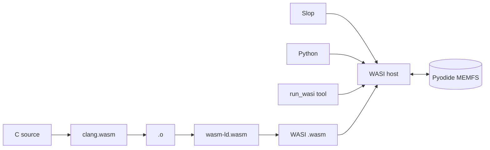

# WASI runtime

[← README](../README.md)

The TypeScript WASI host runs wasm32-wasi modules against the live Pyodide
filesystem. No filesystem snapshot or copy is involved.



## Execution modes

| Mode | When | Properties |
| --- | --- | --- |
| Worker + SAB bridge | `crossOriginIsolated` | Interactive stdin, interruptible |
| Main thread | Fallback | Direct MEMFS access, non-interactive |

Vite sends isolation headers. GitHub Pages uses
`public/coi-serviceworker.js`.

## Run a module

Terminal:

```text
/run app.wasm arg1
```

Python:

```python
import wasi
result = await wasi.run_wasi("/home/web/app.wasm", args=["arg1"])
```

The agent verifies modules directly with `run_wasi`. Slop runs one by command
name or `./path` when execution belongs in a shell workflow. The Python bridge
is for explicit Python/WASI integration.

## Host surface

- `wasi_snapshot_preview1` plus legacy `wasi_unstable`.
- File, path, directory, clock, random, polling, args, environment, and exit
  calls.
- Pluggable filesystem interface shared by the main-thread and RPC hosts.
- Child spawning for Slop pipelines.

The downloaded toolchain assets are checked against pinned SHA-256 digests
before compilation or extraction.

## Source and tests

- Runtime: [`src/wasi/`](../src/wasi/)
- Browser bridge: [`src/wasi/browser-runner.ts`](../src/wasi/browser-runner.ts)
- Tests: [`test/README.md`](../test/README.md)
