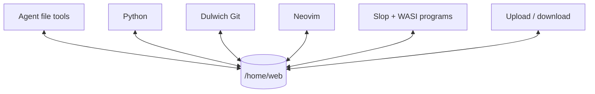
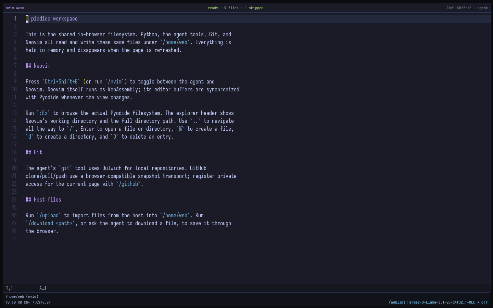

# Workspace

[← README](../README.md)

`/home/web` is one Pyodide MEMFS shared by every tool and view.

## Neovim

- Toggle with `Ctrl+Shift+E` or `/nvim`.
- `:Ex` browses the Pyodide filesystem.
- Buffers sync when switching views.
- Set `VITE_ENABLE_NEOVIM=0` at build time to omit it.

## Host files

| Command | Direction |
| --- | --- |
| `/upload [directory]` | Host → `/home/web` |
| `/download <path>` | `/home/web` → browser download |

The agent can call `download` only after the user asks for a file.

## GitHub

The `git` tool uses Dulwich inside MEMFS. `/github` registers a page-memory
token for clone, pull, and push through the GitHub API.

## Lifetime

| State | Storage |
| --- | --- |
| Workspace, sessions, API keys, GitHub token | Page memory; cleared on refresh |
| Downloaded local models | Browser cache / OPFS |
| Codex OAuth credentials | Optional loopback proxy process only |
